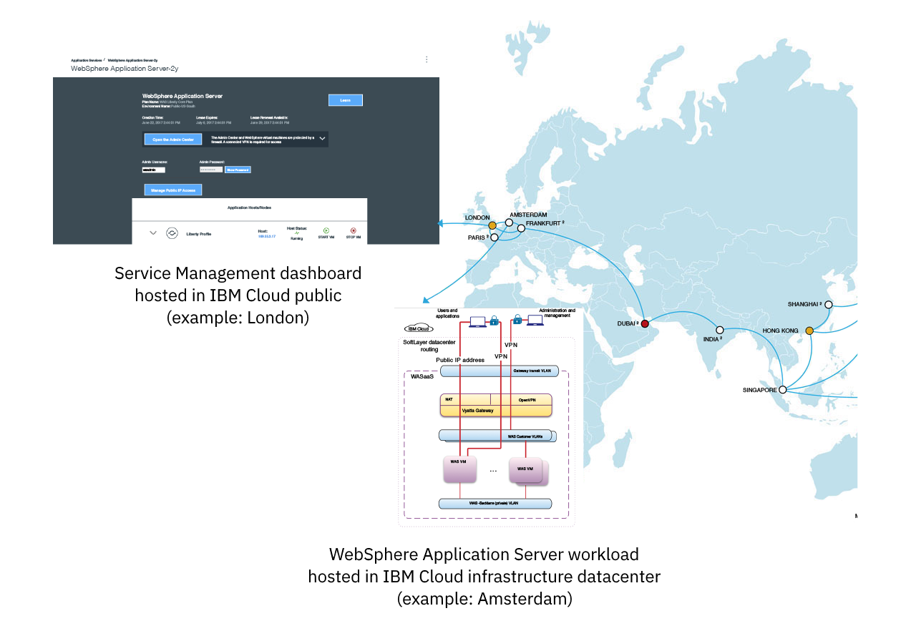

---

copyright:
  years: 2016, 2017
lastupdated: "2017-07-25"

---

{:shortdesc: .shortdesc}
{:new_window: target="_blank"}
{:codeblock: .codeblock}

# Getting Started Guide for Single Tenant Environments
{: #getting_startedSTE}

The WebSphere Application Server in {{site.data.keyword.Bluemix}}:Single Tenant Environment is an offering that provides customers with an isolated WebSphere workload, a fully integrated hybrid environment, and secure data. The Getting Started Guide is designed to identify key elements that assist clients in accessing and managing their WebSphere Application Server in {{site.data.keyword.Bluemix_notm}}: Single Tenant Environment.
{: shortdesc}

## Recommended software
{: #recommended_software}

You need the following software to access your Single Tenant Environment:
* A web browser that is supported by {{site.data.keyword.Bluemix_notm}}:
    * Chrome: the latest version for your operating system
    * Firefox: the latest version for your operating system and ESR 38 or ESR 45
    * Internet Explorer: version 10 or 11
    * Safari: the latest version for the Mac
* Cloud Foundry command line interface, Version 6.5.1 or later (you can use the latest release)
* Git Bash (recommended)
    * Download and install [Git Bash](https://git-scm.com/downloads){: new_window}

## Overview of WebSphere Application Server in {{site.data.keyword.Bluemix_notm}}: Single Tenant Environment
{: #overviewSTE}

The WebSphere Application Server in {{site.data.keyword.Bluemix_notm}}: Single Tenant offering gives consumers their own private instance of the service, private networking, and isolated resources. Although the offering is managed independently, the service and created service instance dashboards are accessible through a specific {{site.data.keyword.Bluemix_notm}} public region as indicated in the following figure:

Figure 1. Architecture of the WebSphere Application Server in {{site.data.keyword.Bluemix_notm}}: Single Tenant Environment

## Organization Management
{: #organization_management}

The WebSphere Application Server in {{site.data.keyword.Bluemix_notm}}: Single Tenant Environment is configured according to your order. If you provided one or more {{site.data.keyword.Bluemix_notm}} organization names as part of the order, you can start accessing your environment now. If you did not provide one or more organization names or if you want to change this setting, open a [support ticket](reportingIssues.html#reporting_issues) for **Application Services** from the {{site.data.keyword.Bluemix_notm}} console of your region. The Organization name (ORG) can be found on the upper right corner of the {{site.data.keyword.Bluemix_notm}} console as shown in the following figure:

Figure 2. Location of Organization name

**Note:** To access your Single Tenant Environment, see [Single Tenant Environment Access](singleTenantAccess.html#singleTenantEnvironment).
