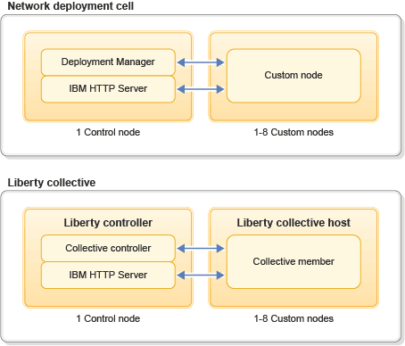

---

copyright:
  years: 2017, 2019
lastupdated: "2019-02-14"

keywords: overview, websphere, liberty, version, cell, collective, vm, virtual machine, t-shirt, block, price, reserve contract

subcollection: wasaas

---

{:shortdesc: .shortdesc}
{:new_window: target="_blank"}
{:codeblock: .codeblock}
{:tip: .tip}

# About
{: #about}

{{site.data.keyword.appserver_full}} facilitates quick setup on a pre-configured WebSphere Application Server Liberty, Traditional Network Deployment, or Traditional WebSphere Java EE instance in a hosted cloud environment on {{site.data.keyword.Bluemix_notm}}.
{: shortdesc}

## Overview of WebSphere Application Server in {{site.data.keyword.Bluemix_notm}}
{: #overview}

WebSphere Application Server in {{site.data.keyword.Bluemix_notm}} provides consumers with pre-configured Traditional WebSphere and Liberty servers. It is hosted on virtual machine guests with root access to the guest operating system. When you are creating your service, choose between _Liberty_, _Traditional ND_, or _Traditional WebSphere_.

**Note:** Consumers are now able to choose between the current fixpack level or one older version [(n or n-1)](/docs/services/ApplicationServeronCloud?topic=wasaas-updating-your-environment#maintenance-strategy){: new_window} when you create any WebSphere Application Server in {{site.data.keyword.Bluemix_notm}} instance.

You are given a familiar WebSphere administration experience and have full access to the underlying operating system. You can reuse your existing scripts and make the little system tweaks that you need to make to work with your own, or third party, frameworks. The Admin Center and Admin Consoles are provided to administer your WebSphere Application Server Liberty, ND or Traditional service, just like your on-premises WebSphere configurations.

The WebSphere Application Server in {{site.data.keyword.Bluemix_notm}} Network Deployment Plan consists of a WebSphere Application Server Network Deployment cell environment with two or more virtual machines. The first virtual machine contains the Deployment Manager and IBM HTTP Server and the remaining virtual machines contain custom nodes (node agents) federated to the Deployment Manager. Use your existing wsadmin scripts to create your WebSphere configuration or use the WebSphere Admin Console to manually configure the environment. These new capabilities allow users to set up a clustered environment, which is a critical aspect of any middleware enterprise application. Clients can now elect to cluster a topology to load balance requests across two or more Instances.

The WebSphere Application Server in {{site.data.keyword.Bluemix_notm}} Network Deployment Plan also includes the use of a Liberty collective. The Liberty collective is an administrative domain for a group of Liberty profiles (servers) and consists of two or more virtual machines. The first virtual machine contains the collective controller Liberty server, which is a control point for the Liberty collective. In addition to the Liberty collective, this virtual machine also contains the IBM HTTP Server, which allows access to your applications from a web browser. The remaining virtual machines are the collective hosts where the collective members reside (Liberty profile servers). The Liberty Admin Center feature is also enabled on the Liberty controller server.

The following figure shows the architecture of the WebSphere Application Server in {{site.data.keyword.Bluemix_notm}} Network Deployment Cell and Liberty collective environments.

Figure 1. Network deployment cell and Liberty collective architecture



**Note**: In _Figure 1_ above, the pattern that depicts collocation of the Deployment Manager or the collective controller with the IBM HTTP Server is intended for development and testing purposes. WebSphere Application Server in {{site.data.keyword.Bluemix_notm}} also gives you the freedom to reconfigure the preinstalled software to meet your production application and operational needs; just as you would on-premises. Further, for the strictest production requirements, contact your IBM Sales representative who can speak to our single-tenant IBM WebSphere Application Server in {{site.data.keyword.Bluemix_notm}} offering, which offers isolated networking and compute resources.


## Operational environment
{: #operational_environment}

IBM WebSphere Application Server in {{site.data.keyword.Bluemix_notm}} is a service that returns guests (virtual machines) in a shared environment for consumers to deploy applications. A VPN protects the public service from generic port scans and other unsolicited network-based attacks. However, it is important to note that the service VPN you use to access your service instance might be shared between multiple {{site.data.keyword.Bluemix_notm}} organizations and users. The virtual machines provide compute, memory, and I/O resources, which come from a shared pool of IaaS resources.

As specific compute, memory, and I/O resources are run by virtual machines in a shared environment, service configurations might vary. Configurations for each specific service instance can be viewed through the IBM WebSphere Application Server in {{site.data.keyword.Bluemix_notm}} service dashboards and portals.

IBM WebSphere Application Server in {{site.data.keyword.Bluemix_notm}} provides virtual machine instances. With these instances, clients use a simple portal to create and manage enterprise WebSphere Application Server deployments in a consistent, repeatable manner with significant flexibility to tune their applications. Users can get up and running on pre-configured WebSphere Application Server Liberty, ND, or Traditional virtual machines in a hosted cloud environment. Users can migrate existing WebSphere Application Server applications to {{site.data.keyword.Bluemix_notm}} and take full control of the underlying OS and middleware.

## Virtual machine sizing
{: #vm-size}

IBM WebSphere Application Server in {{site.data.keyword.Bluemix_notm}} provides T-shirt sizing so that you can right-size environments for memory-intensive applications by provisioning larger virtual machines. Each virtual machine that you provision to run WebSphere Application Server can be independently sized according to the expected resource needs.

Virtual machines are sized and priced in *blocks*. For each block in the T-shirt size, the virtual machine is provisioned with the following resources.
* 1 virtual CPU (vCPU)
* 2 GB RAM
* 12.5 GB of hard drive space (12.0 GB for single-block VMs)


| T-Shirt | Blocks | vCPU | RAM (GB) | HD (GB) |
|:-------:|:------:|:----------:|:--------------:|:-------------:|
| S | 1 | 1 | 2 | 12 |
| M | 2 | 2 | 4 | 25 |
| L | 4 | 4 | 8 | 50 |
| XL | 8 | 8 | 16 | 100 |
| XXL | 16 | 16 | 32 | 200 |
{: caption="Table 1. Blocks per T-shirt size" caption-side="top"}

Each server or node is provisioned in a single virtual machine. For example, in the Network Deployment plan, if you provision one M virtual machine (2 blocks) for your deployment manager and 8 S virtual machines (1 block) for application nodes, you would be charged for a total of 10 blocks.

## Billing options
{: #billing-options}

Pricing for each block depends on the billing option that you choose:
* **[Pay as you go](#pay-as-you-go):** Usage-based billing, priced in hours per block used
* **[Reserve contract](#reserve-contract):** Pre-paid monthly subscriptions of reserved  resources

### Pay as you go
{: #pay-as-you-go}

Pay-as-you-go pricing applies if you provision the IBM WebSphere Application Server in {{site.data.keyword.Bluemix_notm}} service without contacting IBM Sales for alternative billing options. Usage is charged for the full or partial hour of each block that is used during the monthly billing period. Minimum billing is set at 1/4 of a block hour.

**Note**: Due to a specific amount of compute, memory, and I/O resources, stopped instances are charged at a reduced rate of 5% of the hourly block rate. Within the service, stopped instances are limited to 10 IP addresses or 64 GB of memory.

#### Plan pricing

The price per block varies depending on the WebSphere Application Server plan that you choose.

The following table lists the total price per hour for each T-shirt sized virtual machine. The prices represent IBM WebSphere Application Server in {{site.data.keyword.Bluemix_notm}} plans as of April 1, 2016 and are listed in US dollars (USD). See the catalog for current prices in your region.

| T-Shirt | Blocks | Liberty Core | WAS Base | WAS ND |
|:-------:|:------:|:----------:|:------:|:----------:|
| S | 1 | $0.21 | $0.30 |  $0.70 |
| M | 2 | $0.42 | $0.60 |  $1.40 |
| L | 4 | $0.84 | $1.20 |  $2.80 |
| XL | 8 | $1.68 | $2.40 |  $5.60 |
| XXL | 16 | $3.36 | $4.80 |  $11.20 |
{: caption="Table 2. Liberty Core plan" caption-side="top"}


### Reserve contract
{:#reserve-contract}

With reserve contract billing, you purchase a pre-paid monthly subscription that guarantees access to blocks of physically reserved computational resources. These service blocks are set aside for your exclusive use and cannot be considered as available capacity for any other WebSphere Application Server in {{site.data.keyword.Bluemix_notm}} users. If you have existing WebSphere Application Server licenses, you can choose a bring-your-own-license reserve contract, which uses these licenses and has a reduced billing rate. To set up reserve contract billing, [contact IBM Sales](/docs/services/ApplicationServeronCloud?topic=wasaas-reporting_issues#contacting-sales).

Subscriptions are available in 8-block increments. The total block hours are based on the number of hours in the month, but you can use the block hours at any point throughout the month. For example, a 30-day month has 720 hours, which when multiplied by an 8-block subscription results in a total of 5,760 block hours.

  ```
30 days * 24 hours per day * 8 blocks = 5,760 block hours
  ```

You can tailor how and when you use the blocks to meet variable workload demand, such as using 4 blocks, increasing to 12 blocks, and then reducing to 8 blocks. As long as you stay under the total block hours in the month, there is no additional charge.

You can choose whether to use your reserve contract blocks or to use pay-as-you-go billing when you provision each environment.

**Note:** If you delete a service instance, you might have to wait about 30 minutes for its blocks to become available to new service instances.

#### Overages

If your usage exceeds the monthly block hours in your subscription, overage is charged according to the pay-as-you-go billing model, so you are only charged for the extra block hours that you use. Block usage is measured on a full or partial hourly basis, with the minimum usage at 1/4 of a block hour.

Blocks from the pay-as-you-go model are not reserved capacity and come from a common resource pool.

#### Proration rates for flexible use

Blocks in reserve contract billing are based on the WebSphere Application Server Network Deployment plan, but you can also use the blocks for other plans. With other plans, usage is prorated so that one block hour is reduced by the plan's proration rate when it is reflected in your remaining reserve contract block hours.

The following table shows the proration rates for each plan and the effective price per actual block hour after the proration is calculated. For current prices in your region, [contact IBM Sales](/docs/services/ApplicationServeronCloud?topic=wasaas-reporting_issues#contacting-sales).

| Plan | Proration rate | Price/hour after proration |
|:-------:|:------:|:------:|
| WebSphere Application Server Liberty Core | 0.3 | $0.21 |
| WebSphere Application Server Base  | 0.43 | $0.30 |
| WebSphere Application Server Network Deployment | 1.0 | $0.70 |
{: caption="Table 3. Block hour proration rates by plan" caption-side="top"}

For example, you might have a M (2-block) WebSphere Application Server Base instance that runs for 51 hours. To calculate the block hours used from your reserve contract, the actual block hours are multiplied by the proration rate, for a total of 43.86 block hours:

```
2 blocks * 51 hours * 0.43 proration = 43.86 prorated block hours
```

The total cost stays the same, but you can use more actual block hours of the prorated plans because they deduct less from your reserve contract block hours.
{:.tip}
