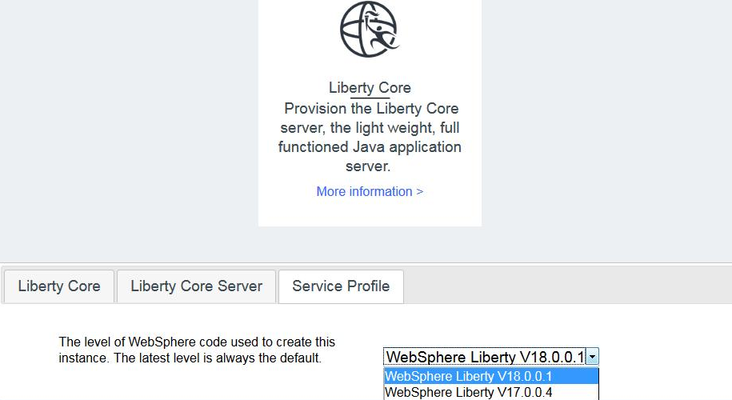

---

copyright:
  years: 2016, 2017
lastupdated: "2017-11-03"

---

{:shortdesc: .shortdesc}
{:new_window: target="_blank"}
{:codeblock: .codeblock}

# Maintenance and VM updates
{: #maintenance_and_vm_updates}

## Maintenance Strategy
{: #maintenance_strategy}

IBM WebSphere Application Server in {{site.data.keyword.Bluemix_notm}} is updated on a regular cadence, ensuring that new service instances are created with current fixpacks and patches. The cloud brings easy and rapid provisioning of new service instances to middleware management. Many consumers are expected to upgrade to a new service instance when they want to apply maintenance. However, for consumers who want to retain long lived service instances, you can apply maintenance as if on-premises by using the [Installation Manager](http://www.ibm.com/support/knowledgecenter/SSDV2W_1.8.3/com.ibm.cic.agent.ui.doc/helpindex_imic.html){: new_window} installed in the */home/virtuser/IBM/Installation Manager* directory.

Additionally, consumers can create a WebSphere Application Server in {{site.data.keyword.Bluemix_notm}} instance using an older fixpack level if desired to conform with hybrid cloud deployment requirements. You can choose between the current fixpack level or one older version (n or n-1) through the Service Profile tab in the {{site.data.keyword.Bluemix_notm}} Service Dashboard.

For Liberty instances, choose between 17.0.0.2 and 17.0.0.3 as shown in Figure 1:

Figure 1. Fixpack selection choices for Liberty Core instances

For Traditional WebSphere instances, choose between 8.5.5.11, 8.5.5.12, 9.0.0.4 or 9.0.0.5 as shown in Figure 2:

Figure 2. Fixpack selection choices for Traditional WebSphere instances

**Avoid trouble:** Since the underlying binaries are installed as **virtuser**, a limited administrative virtual user, ensure that all fix packs and interim fixes are installed as **virtuser**.

## VM Updates

The following section explains how to apply virtual machine system changes.

You can update your VM like any other normal RHEL system. By using the Red Hat package manager **Yum**, you are able to install, update, uninstall, and do various other things with your packages. Your system is set up to receive these updates from IBM's Red Hat Satellite Server. This satellite provides you with safe and secure packages from the Red Hat Network by the Yum package manager. The Satellite Server is IBM Managed and cannot be modified from your system.

For more information, see [Applying package updates on Red Hat Enterprise Linux](https://access.redhat.com/articles/11258#rhel6){: new_window} and [Yum, the Red Hat package manager](https://access.redhat.com/documentation/en-US/Red_Hat_Enterprise_Linux/6/html/Deployment_Guide/ch-yum.html){: new_window}.
