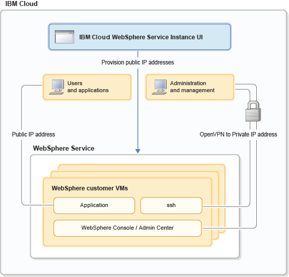

---

copyright:
  years: 2017, 2019
lastupdated: "2019-07-10"

keywords: public ip, vpn, private ip, dns, port, custom vm, resource group

subcollection: wasaas

---

{:shortdesc: .shortdesc}
{:new_window: target="_blank"}
{:codeblock: .codeblock}

# Network environment
{: #networkEnvironment}

After your {{site.data.keyword.appserver_full}} service instance is provisioned, you can access your VM in several ways. You can connect over a secure VPN to get SSH, traditional WebSphere Admin Console, and application access to your VM. You can also connect your VM to the internet with a public IP address.

The following diagram shows these network paths:

Figure 1. Client view of Multi-tenant networking with Public IP



## VPN access
{: #vpnAccess}

After you provision a WebSphere Application Server in {{site.data.keyword.Bluemix_notm}} service instance from the service dashboard in the {{site.data.keyword.Bluemix_notm}} UI, you can establish an OpenVPN connection. To create the connection, expand the drop-down menu and click **Download VPN Configuration** to download your VPN configuration. The VPN configuration contains an `.ovpn` file and certificates that are used to authenticate with the OpenVPN server. Once the OpenVPN connection is established, you can then access your VM through SSH. You can also access your Liberty Admin Center, traditional WebSphere Admin Console, and applications.

The VPN configuration is scoped to your organization or resource group and region. It is valid for one year from the time created. Multiple OpenVPN client connections can be established simultaneously by using the same VPN configuration.

**Note:** Your VPN configuration is only valid if your organization or resource group contains **active** subscriptions. When the last subscription for an organization or resource group is deleted, all the VPN configurations for the organization or resource group are suspended. Unexpired VPN configurations are automatically reactivated when a new subscription becomes active.

## Advanced VPN configuration management
{: #advancedVPN}

In most cases, you need only a single VPN configuration that you can download by using the **Download VPN Configuration** button. However, the advanced VPN management page, which is accessed by clicking **Advanced VPN Management** on the service dashboard, lets you create and manage multiple VPN configurations. Having multiple configurations might be helpful to transition smoothly to a new VPN configuration when the old one is about to expire. You can also request multiple VPN configurations to manage access to your VMs with different individuals or teams.  

**Note:** You are allowed a **maximum** of 10 active VPN configurations for your organization or resource group at any time.

If your VPN configurations are compromised or expired, you can revoke VPN configuration by using the advanced VPN management page. Additionally, from an audit perspective, you can view a history of all VPN management activity and download active VPN configurations that were created previously from the advanced VPN management page.

All the features available from the service dashboard in the {{site.data.keyword.Bluemix_notm}} UI can also be scripted by using our REST APIs. For more information, see the WebSphere Application Server in {{site.data.keyword.Bluemix_notm}} [REST API Documentation](https://wasaas-broker.us-south.websphereappsvr.cloud.ibm.com/wasaas-broker/api/v3){: new_window}.


## Public internet access
{: #publicInternetAccess}

Optionally, you can manage public internet access from the service dashboard in the {{site.data.keyword.Bluemix_notm}} UI. You can **request** a public IP address from the pool and **open** the connection from the internet to your WebSphere Application Server in {{site.data.keyword.Bluemix_notm}} service instance. Conversely, you can **close** access from your service instance to the internet and **return** the public IP address to the pool.

### Request a public IP address and open a connection
{: #request-open-ip}

1. Click **Manage Public IP Access** on the service dashboard in the {{site.data.keyword.Bluemix_notm}} console.
2. The IP address for your host is shown, but not your public IP address. Click **Request Public IP Address**.

    You are returned to the service dashboard with a public IP assigned. However, the following message is displayed:

    > _Access is currently closed. Click Manage Public IP to Open Access._
3. Click **Manage Public IP Access** on the service dashboard.
4. The IP addresses for your host and your new public IP are shown, but access is closed. Click **Open Access**.

    You are returned to the service dashboard with the following message displayed:

    > _Access is currently open. Click Manage Public IP to Close Access._
5. The IP address is now open in the gateway firewall. Configure your server to expose the port. See [Public IP ports](#publicIPports).

### Close a connection and return a public IP address
{: #close-return-ip}

1. Click **Manage Public IP Access** on the service dashboard.
2. Click **Close Access**.

    You are returned to the service dashboard with the following message displayed:

    > _Access is currently closed. Click Manage Public IP to Open Access._
3. Click **Manage Public IP Access** on the service dashboard in the {{site.data.keyword.Bluemix_notm}} UI.
4. Click **Return Public IP Address**.

    You are returned to the service dashboard where the IP address of your host is shown with the following message displayed:

    > _Returned Public IP._

## Public IP ports
{: #publicIPports}

When you open access to your public IP, the IP address is associated with your VM, and ports 80 and 443 are opened at the gateway. However, by default, Liberty Core, and traditional WebSphere Base servers do not open ports 80 and 443. Conversely, ports 80 and 443 are opened by default on the IBM HTTP Server. Therefore, you might need to configure your Liberty Core and traditional WebSphere Base servers to listen for application traffic on port 80 and 443 when you use public IP.
* To configure your Liberty Core server, see [Configure Liberty Core Server for public access](/docs/services/ApplicationServeronCloud?topic=wasaas-networkEnvironment#configureLibertyForPublicAccess).
* To configure your traditional WebSphere Base server, add a web container transport chain that listens on port 80 and 443 as described in [Configuring transport chains](https://www.ibm.com/support/knowledgecenter/SSEQTP_9.0.5/com.ibm.websphere.base.doc/ae/trun_chain_transport.html){: new_window}.

**Avoid trouble:** Linux reserves ports smaller than 1024 for privileged users, such as **root**. However, it is a common practice to run traditional WebSphere Base servers as a **non-root** user. Therefore, when you add a Web container transport chain, change your **iptables** configuration as the **root** user. Specifically, redirect restricted ports 80 and 443 to another port over 1024, such as 9080 and 9443. The following commands provide an example of this process:

```
-bash-4.1# sudo iptables -t nat -A PREROUTING -p tcp --dport 80 -j REDIRECT --to-port 9080
-bash-4.1# sudo iptables -I INPUT -p tcp -m tcp --dport 80 -j ACCEPT
-bash-4.1# sudo iptables -I INPUT -p tcp -m tcp --dport 9080 -j ACCEPT

-bash-4.1# sudo iptables -t nat -A PREROUTING -p tcp --dport 443 -j REDIRECT --to-port 9443
-bash-4.1# sudo iptables -I INPUT -p tcp -m tcp --dport 443 -j ACCEPT
-bash-4.1# sudo iptables -I INPUT -p tcp -m tcp --dport 9443 -j ACCEPT
```

**Note:** Changes to **iptables** are ephemeral. For example, if your guest is rebooted or if the **iptables** service is restarted, the rules are automatically flushed and reset. To save the rules so that they are persisted when the iptables service is started or the guest is rebooted, use the following command as the **root** user:

```
-bash-4.1# service iptables save
iptables: Saving firewall rules to /etc/sysconfig/iptables:[  OK  ]

bash-4.1# cat /etc/sysconfig/iptables
# Generated by iptables-save v1.4.7 on Wed May 31 19:44:11 2017
*nat
:PREROUTING ACCEPT [0:0]
:POSTROUTING ACCEPT [23:1706]
:OUTPUT ACCEPT [23:1706]
-A PREROUTING -p tcp -m tcp --dport 80 -j REDIRECT --to-ports 9080
-A PREROUTING -p tcp -m tcp --dport 443 -j REDIRECT --to-ports 9443
COMMIT
# Completed on Wed May 31 19:44:11 2017
# Generated by iptables-save v1.4.7 on Wed May 31 19:44:11 2017
*filter
:INPUT DROP [0:0]
:FORWARD DROP [0:0]
:OUTPUT DROP [0:0]
-A INPUT -p tcp -m tcp --dport 9443 -j ACCEPT
-A INPUT -p tcp -m tcp --dport 443 -j ACCEPT
-A INPUT -p tcp -m tcp --dport 9080 -j ACCEPT
-A INPUT -p tcp -m tcp --dport 80 -j ACCEPT

```


**Note:** **iptables** are invoked on requests that travel over the guest's external interface. Requests that travel over the local loopback (127.0.0.1) are not processed by **iptables** so redirecting ports, as noted earlier, would not be invoked over loopback.

## VPN private IP ports
{: #privateIPports}

You connect to your VM's private IP address over the VPN connection. Your Liberty Admin Center (9080, 9443), traditional WebSphere Admin Console (9060, 9043), SSH (22), and ports other than 80 and 443 are only accessible through the VPN connection as depicted in Figure 1. See the sample Liberty Core **server.xml** and **ibm-web-bnd.xml** for details about separating the Liberty Admin Center from your application ports.

**Avoid trouble:** For Liberty Core and traditional WebSphere Base servers, the Firewall ports are preconfigured when your VM is provisioned. However, for Network Deployment configurations where the Deployment manager or the Collective controller is collocated with the IBM HTTP Server, you might need to open ports on the firewall. See [Firewall ports](/docs/services/ApplicationServeronCloud?topic=wasaas-system_access#firewall_ports) for details.

## Configuring a Liberty Core server for a public IP access
{: #configureLibertyForPublicAccess}

You need to configure Liberty Core to listen for application traffic on port 80 and 443 when you use the public IP.

By default, Liberty is configured with the Liberty Admin Center and applications available on the **default_host** virtual host, which is associated with the **defaultHttpEndpoint** on port 9080 and 9443. Reconfigure your server to separate the Liberty Admin Center from the application virtual host and endpoint and make them available on separate ports.

The following snippet is an example of server.xml configuration adjustments:

```    
    <!-- open port 9080/9443 for incoming http connections -->
    <httpEndpoint id="defaultHttpEndpoint"
        host="*"
        httpPort="9080"
        httpsPort="9443">
        <tcpOptions soReuseAddr="true"/>
    </httpEndpoint>

    <!-- define a new endpoint for public app traffic -->
    <httpEndpoint id="publicHttpEndpoint"
        host="*"
        httpPort="80"
        httpsPort="443">
        <tcpOptions soReuseAddr="true"/>
    </httpEndpoint>

    <!–- restrict default_host to vpn so the Liberty Admin Center is not public -->
    <virtualHost id="default_host" allowFromEndpointRef="defaultHttpEndpoint">
      <hostAlias>*:9080</hostAlias>
      <hostAlias>*:9443</hostAlias>
    </virtualHost>

    <virtualHost id="external_host">
      <hostAlias>*:80</hostAlias>
      <hostAlias>*:443</hostAlias>
    </virtualHost>
```
{: codeblock}

Now associate your application with the `external_host` virtual host by including the following snippet in your application's `WEB-INF/ibm-web-bnd.xml` file:

```
    <?xml version="1.0" encoding="UTF-8"?>
    <web-bnd
        xmlns="http://websphere.ibm.com/xml/ns/javaee"
        xmlns:xsi="http://www.w3.org/2001/XMLSchema-instance"
        xsi:schemaLocation="http://websphere.ibm.com/xml/ns/javaee   
        http://websphere.ibm.com/xml/ns/javaee/ibm-web-bnd_1_0.xsd"
        version="1.0">

        <virtual-host name="external_host" />
    </web-bnd>
```
{: codeblock}

## Configuring DNS
{: #dnsConfig}

It is important to note that WebSphere Application Server in {{site.data.keyword.Bluemix_notm}} VMs are configured with two DNS resolvers. The resolvers are configured in the **/etc/resolv.conf** file on the VM. The primary DNS server is a non-authoritative server that is provided by the WebSphere Application Server in {{site.data.keyword.Bluemix_notm}} service. The secondary DNS server is a non-authoritative server that is provided by {{site.data.keyword.Bluemix_notm}}.

We recommend that you review the DNS configuration to see whether it fits your needs. You can update the `/etc/resolv.conf` file to reference the DNS server of your choice if the ones provided by IBM do not meet your requirements.

**Note:** Older WebSphere Application Server in {{site.data.keyword.Bluemix_notm}} VMs might  have only a primary DNS server configured in the `/etc/resolv.conf` file. If you want a HA solution, you can either release the VM and provision a new one or update the `/etc/resolv.conf` file to add a secondary DNS server. The secondary DNS server can be your preferred DNS server or the one provided by {{site.data.keyword.Bluemix_notm}} (10.0.80.11).


## Opening ports for new servers on custom nodes
{: #serversOnCustom}

When you create a server on a custom node, the additional ports that are required by the server must be opened on the deployment manager and custom node VMs before you start the server. After you create the server, but before you start the server, open the ports by running the `openWASPorts.sh` script.

 1. Log in to each deployment manager and custom VM as the root user.
 1. Run the `/opt/IBM/WebSphere/AppServer/virtual/bin/openWASPorts.sh` script to open the ports.

After you run the script, you can start the server from the deployment manager admin console.
