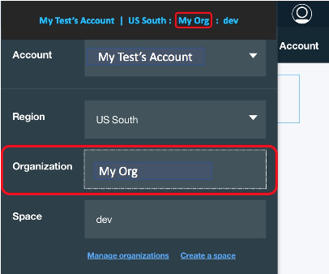

---

copyright:
  years: 2017, 2018
lastupdated: "2018-10-25"

---

{:shortdesc: .shortdesc}
{:new_window: target="_blank"}
{:codeblock: .codeblock}

# Single-Tenant-Umgebungen
{: #getting_startedSTE}

Die Single-Tenant-Umgebung von {{site.data.keyword.appserver_full}} bietet Kunden eine isolierte WebSphere-Workload, eine voll integrierte Hybridumgebung und geschützte Daten. In dieser Anleitung zur Einführung werden zentrale Elemente beschrieben, die Kunden beim Zugriff auf die Single-Tenant-Umgebung von WebSphere Application Server in {{site.data.keyword.Bluemix_notm}} und bei deren Verwaltung unterstützen.
{: shortdesc}

## Single-Tenant-Umgebung bestellen
{:#ordering}

Single-Tenant-Umgebungen können nicht über den {{site.data.keyword.Bluemix_notm}}-Katalog erstellt werden. Zur Bestellung einer Single-Tenant-Umgebung müssen Sie den IBM Vertrieb kontaktieren. Bei der Bestellung der Umgebung können Sie eine standardmäßige Single-Tenant-Umgebung oder eine BYOL-Single-Tenant-Umgebung (Bring Your Own License) auswählen. Standardmäßige Single-Tenant-Umgebungen umfassen alle erforderlichen Infrastruktur- und WebSphere Application Server-Lizenzen. BYOL-Single-Tenant-Umgebungen ermöglichen Ihnen die Verwendung separater WebSphere Application Server-Lizenzen.

[Kontaktieren Sie den IBM Vertrieb](reportingIssues.html#contacting-sales), wenn Sie eine Single-Tenant-Umgebung bestellen möchten. Das Vertriebsteam kann Sie beim Einrichten einer an Ihre Bedürfnisse angepassten Umgebung unterstützen.

## Übersicht zu WebSphere Application Server in {{site.data.keyword.Bluemix_notm}}: Single-Tenant-Umgebung
{: #overviewSTE}

Mit dem Single-Tenant-Angebot von WebSphere Application Server in {{site.data.keyword.Bluemix_notm}} stehen Kunden eine eigene private Instanz des Service, privater Netzbetrieb und isolierte Ressourcen zur Verfügung. Obwohl das Angebot unabhängig verwaltet wird, kann auf den Service und die erstellten Serviceinstanzdashboards über eine spezielle öffentliche {{site.data.keyword.Bluemix_notm}}-Region zugegriffen werden, wie in der folgenden Abbildung dargestellt:

Abbildung 1. WebSphere Application Server-Architektur in {{site.data.keyword.Bluemix_notm}}: Single-Tenant-Umgebung

## Organisationsverwaltung
{: #organization_management}

Die Single-Tenant-Umgebung von WebSphere Application Server in {{site.data.keyword.Bluemix_notm}} wird Ihrer Bestellung entsprechend konfiguriert. Wenn Sie im Rahmen der Bestellung einen oder mehrere {{site.data.keyword.Bluemix_notm}}-Organisationsnamen angegeben haben, können Sie sofort auf die Umgebung zugreifen. Wenn Sie keinen Organisationsnamen angegeben haben oder wenn Sie diese Einstellung ändern möchten, öffnen Sie ein [Support-Ticket](reportingIssues.html#reporting_issues) für **Application Services** in der {{site.data.keyword.Bluemix_notm}}-Konsole Ihrer Region. Der Organisationsname (ORG) befindet sich in der rechten oberen Ecke der {{site.data.keyword.Bluemix_notm}}-Konsole, wie in der folgenden Abbildung dargestellt:

Abbildung 2. Position der Organisationsnamen

**Hinweis:** Informationen zum Zugriff auf die Single-Tenant-Umgebung finden Sie in [Zugriff auf die Single-Tenant-Umgebung](singleTenantAccess.html#singleTenantEnvironment).
