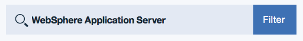

---

copyright:
  years: 2017, 2019
lastupdated: "2019-02-15"

---

{:shortdesc: .shortdesc}
{:new_window: target="_blank"}
{:codeblock: .codeblock}

# Zugriff auf Single-Tenant-Umgebungen
{: #singleTenantEnvironment}

In den folgenden Schritten werden der Zugriff auf die Single-Tenant-Umgebung und Methoden der Erstellung einer Serviceinstanz beschrieben.
{: shortdesc}

## Zugriff auf die Single-Tenant-Umgebung
{: #accessSTE}

1. Rufen Sie im Browser den [{{site.data.keyword.cloud_notm}}-Katalog](https://{DomainName}/catalog/){: new_window} auf.

2. Klicken Sie auf **Anmelden** und melden Sie sich mit Ihrer IBMid an.

6. Geben Sie im Suchfilter des Katalogs **WebSphere Application Server** ein.

    

7. Klicken Sie unter **Application Services** auf die Kachel **WebSphere Application Server**.

    

8. Wählen Sie im Menü **Umgebung** Ihre Single-Tenant-Umgebung aus.

    

    **Probleme vermeiden:** Standardmäßig wird möglicherweise die öffentliche Umgebung angezeigt. Bei der Anzeige des korrekten Umgebungsnamens wird davon ausgegangen, dass Sie bei der korrekten Region angemeldet und Mitglied einer Organisation sind, die über Zugriffsberechtigung für Ihre Single-Tenant-Umgebung verfügt.

    **Hinweis:** Wenn Sie eine der öffentlichen Umgebungen auswählen, fallen möglicherweise Gebühren auf Stundenbasis an. Öffnen Sie daher ein Support-Ticket, wenn der Name Ihrer Single-Tenant-Umgebung nicht angezeigt wird. Siehe hierzu die Beschreibung auf der Seite [Hilfe anfordern](/docs/services/ApplicationServeronCloud?topic=wasaas-reporting_issues#reporting_issues){: new_window}.

9. Wählen Sie den entsprechenden Plan aus und klicken Sie auf **Erstellen**.

    

**Hinweis:** Eine Preisstruktur mit einer Abrechnung auf Stundenbasis ist für Single-Tenant-Umgebungen nicht anwendbar. Eine Single-Tenant-Umgebung enthält eine festgelegte Anzahl von **Blöcken**, die als Kontingent bezeichnet werden. Eine kleine Umgebung enthält 64 Blöcke. Eine mittlere Umgebung enthält 128 Blöcke. Eine große Umgebung enthält 256 Blöcke.

Ein **Block** ist wie folgt definiert:
  * 1 vCPU
  * 12,5 GB Festplattenspeicherplatz[1]
  * 2 GB RAM

[1] *Technisch ausgedrückt enthält ein kleines System nur 12 GB Plattenspeicherplatz. Ein mittleres System enthält 25 GB Plattenspeicherplatz, ein großes System enthält 50 GB Plattenspeicherplatz usw.*

Geben Sie für jede virtuelle Maschine, die Sie erstellen, die gewünschte Größe als T-Shirt-Größe an: S, M, L, XL oder XXL. Dies entspricht 1, 2, 4, 8 und 16 Blöcken. Wenn Sie eine T-Shirt-Größe auswählen, wird die entsprechende Anzahl von Blöcken von Ihrem Kontingent abgezogen.

Beispiel: Sie verwenden eine kleine Umgebung mit 64 Blöcken. Innerhalb dieser Umgebung haben Sie Serviceinstanzen mit zweimal XXL, dreimal XL und einmal L konfiguriert, also mit 60 genutzten Blöcken insgesamt. Wenn Sie für ein neues Liberty Core-Abonnement die Größe M auswählen, wird möglicherweise eine Nachricht angezeigt, die Ihr Kontingent und die Anzahl der noch verfügbaren Blöcke angibt:

> **Ihr Single-Tenant-Speicherkontingent für diesen Service umfasst 64 Blöcke. Einschließlich der aktuellen Konfiguration verbleiben 2 Blöcke. Wenn Sie das Speicherkontingent erhöhen möchten, wenden Sie sich an den IBM Vertrieb.**

## Private Netzumgebung
{: #private_network}

Nach der Bereitstellung der Single-Tenant-Umgebung können Sie Ihre VPN-Berechtigungsnachweise herunterladen und eine OpenVPN-Verbindung einrichten. Weitere Informationen können Sie über die folgenden Links aufrufen:

* [VPN-Zugriff](/docs/services/ApplicationServeronCloud?topic=wasaas-networkEnvironment#vpnAccess){: new_window}
* [OpenVPN einrichten](/docs/services/ApplicationServeronCloud?topic=wasaas-system_access#setup_openvpn){: new_window}

## Single-Tenant-Umgebung verwalten
{: #manageSTE}

Wenn Sie Ihrer vorhandenen Single-Tenant-Umgebung zusätzliche Kapazität hinzufügen oder Kapazität in einem anderen Rechenzentrum bestellen möchten, wenden Sie sich an die Call-Center für Nord- und Südamerika, an den IBM Ansprechpartner vor Ort oder an den IBM Business Partner. Einzelheiten hierzu finden Sie in [Kontaktaufnahme mit dem Vertrieb](/docs/services/ApplicationServeronCloud?topic=wasaas-reporting_issues#contacting-sales).
