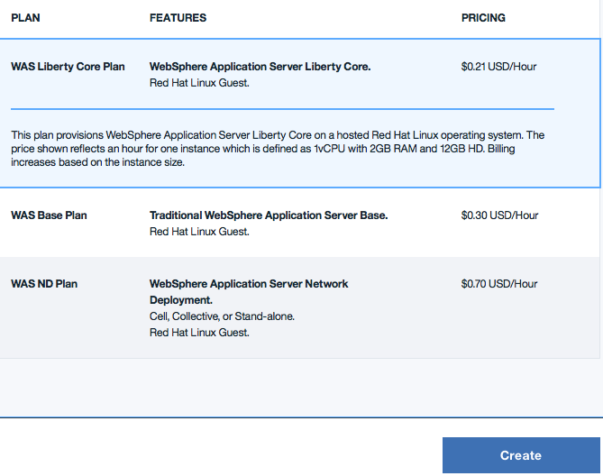

---

copyright:
  years: 2017, 2018
lastupdated: "2018-06-08"

---

{:shortdesc: .shortdesc}
{:new_window: target="_blank"}
{:codeblock: .codeblock}

# Accès à un environnement à service exclusif
{: #singleTenantEnvironment}

Les étapes suivantes vous expliquent comment accéder à votre environnement à service exclusif, tout en proposant des méthodes de création d'une instance de service.
{: shortdesc}

## Accès à votre environnement à service exclusif
{: #accessSTE}

1. Dans votre navigateur, accédez au catalogue [{{site.data.keyword.cloud_notm}} ](https://console.bluemix.net/catalog/){: new_window}.

2. Cliquez sur **Connexion** et connectez-vous avec votre ID IBMid.

6. Dans le filtre de recherche du catalogue, entrez **WebSphere Application Server**.

    

7. Sous **Services d'application**, cliquez sur la vignette **WebSphere Application Server**.

    

8. Dans le menu **Environnement**, sélectionnez votre environnement à service exclusif.

    

    **Evitez les problèmes :** l'environnement public doit s'afficher en tant qu'environnement par défaut. L'affichage du nom d'environnement correct suppose que vous êtes connecté à la région adéquate et que vous êtes membre d'une organisation qui est autorisée à accéder à votre environnement à service exclusif.

    **Remarque :** si vous sélectionnez l'un des environnements publics, une facturation horaire peut vous être appliquée. De ce fait, si vous ne voyez pas le nom de votre environnement à service exclusif, ouvrez un ticket de demande de service, comme défini sur la page [Support client](https://console.bluemix.net/docs/support/index.html#contacting-support){: new_window}.

9. Sélectionnez le plan approprié et cliquez sur **Créer**.

    

**Remarque :** la tarification horaire ne s'applique pas pour les environnements à service exclusif. Un environnement à service exclusif inclut un nombre fixe de **blocs**, appelé quota. Un petit environnement contient 64 blocs, un moyen, 128 blocs, et un grand, 256 blocs.

Un **bloc** est défini de la façon suivante :
  * 1 UC virtuelle
  * 12,5 Go de disque[1]
  * 2 Go de RAM

[1] *Techniquement, un petit système ne contient que 12 Go de disque. Un système moyen contient 25 Go de disque, un grand système, 50 Go, et ainsi de suite.*

Pour chaque machine virtuelle que vous créez, spécifiez la taille standard que vous voulez utiliser - S, M, L, XL ou XXL - qui correspond à 1, 2, 4, 8 et 16 blocs. Quand vous sélectionnez une taille standard, le nombre correspondant de blocs est déduit de votre quota.

Supposez, par exemple, que vous disposiez d'un petit environnement, qui contient 64 blocs. Au sein de cet environnement, vous avez configuré des instances de service contenant deux blocs de taille XXL, trois blocs de taille XL et un bloc de taille L, pour un total de 60 blocs utilisés. Si vous sélectionnez une taille standard M pour un nouvel abonnement Liberty Core, un message peut s'afficher qui indique votre quota et le nombre de blocs qui sont encore disponibles :

> **Votre quota de mémoire à service exclusif pour ce service est de 64 blocs. En incluant votre configuration actuelle, il reste 2 blocs. Pour augmenter votre quota de mémoire, prenez contact avec IBM Sales.**

## Environnement de réseau privé
{: #private_network}

Une fois votre environnement WebSphere Application Server in {{site.data.keyword.Bluemix_notm}}: Single Tenant Environment mis à disposition, vous pouvez télécharger vos données d'identification VPN et établir une connexion OpenVPN. Pour plus d'informations, voir les liens suivants :

* [Accès au VPN (réseau privé virtuel)](https://console.bluemix.net/docs/services/ApplicationServeronCloud/networkEnvironment.html#vpnAccess){: new_window}
* [Configuration d'OpenVPN](https://console.bluemix.net/docs/services/ApplicationServeronCloud/systemAccess.html#setup_openvpn){: new_window}

## Gestion de votre environnement à service exclusif
{: #manageSTE}

Pour ajouter une capacité supplémentaire à votre environnement WebSphere Application Server in {{site.data.keyword.Bluemix_notm}}: Single Tenant Environment existant ou pour commander une capacité dans un autre centre de données, contactez l'un des centres d'appels situés sur le continent américain, votre interlocuteur IBM ou votre partenaire commercial IBM. Pour connaître votre interlocuteur ou partenaire, appelez le +1 800 426 4968. Pour plus d'informations, contactez l'un des centres d'appels situés sur le continent américain. Téléphone : +1 800 IBM CALL (426 2255) Fax : +1 800 2IBM FAX (242 6329).

## Prise en charge de votre environnement à service exclusif
{: #supportingSTE}

Si vous rencontrez des problèmes, vous pouvez vous faire aider en ouvrant un ticket de demande de service, comme défini sur la page [Support client](https://console.bluemix.net/docs/support/index.html#contacting-support){: new_window}.
