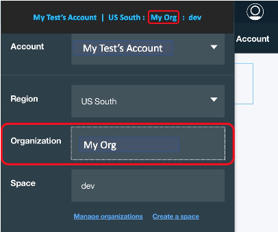

---

copyright:
  years: 2017, 2018
lastupdated: "2018-10-25"

---

{:shortdesc: .shortdesc}
{:new_window: target="_blank"}
{:codeblock: .codeblock}

# シングル・テナント環境
{: #getting_startedSTE}

{{site.data.keyword.appserver_full}}: シングル・テナント環境は、独立した WebSphere ワークロード、完全統合されたハイブリッド環境、およびセキュア・データをお客様に提供します。この入門ガイドの目的は、お客様が WebSphere Application Server in {{site.data.keyword.Bluemix_notm}}: シングル・テナント環境にアクセスして、管理できるよう支援する主要要素を示すことです。
{: shortdesc}

## シングル・テナント環境の注文
{:#ordering}

シングル・テナント環境は {{site.data.keyword.Bluemix_notm}} カタログを使用して作成することはできません。IBM 営業担当員に問い合わせて注文する必要があります。環境を注文するときに、「標準シングル・テナント環境」または「独自ライセンス使用シングル・テナント環境」から選択できます。標準シングル・テナント環境には、すべての必要なインフラストラクチャーと WebSphere Application Server のライセンスが含まれます。独自ライセンス使用シングル・テナント環境によって、個別の WebSphere Application Server ライセンスを使用できます。

シングル・テナント環境を注文するには、[IBM 営業担当員にお問い合わせください](reportingIssues.html#contacting-sales)。営業担当チームは、お客様のニーズに合わせた環境のセットアップを支援します。

## WebSphere Application Server in {{site.data.keyword.Bluemix_notm}}: シングル・テナント環境の概要
{: #overviewSTE}

WebSphere Application Server in {{site.data.keyword.Bluemix_notm}}: シングル・テナント・オファリングにより、利用者は、サービスの専用プライベート・インスタンス、プライベート・ネットワーキング、および独立したリソースを利用できます。 このオファリングは独立して管理されますが、サービス・ダッシュボードおよび作成されたサービス・インスタンスのダッシュボードには、以下の図に示すように、特定の {{site.data.keyword.Bluemix_notm}} パブリック地域を介してアクセスできます。

図 1. WebSphere Application Server in {{site.data.keyword.Bluemix_notm}}: シングル・テナント環境のアーキテクチャー

## 組織管理
{: #organization_management}

WebSphere Application Server in {{site.data.keyword.Bluemix_notm}}: シングル・テナント環境は、お客様のオーダーに従って構成されます。 オーダーの一部として 1 つ以上の {{site.data.keyword.Bluemix_notm}} 組織名を指定した場合、ただちに環境へのアクセスを開始できます。 1 つ以上の組織名を指定しなかった場合、またはこの設定を変更する場合、地域の {{site.data.keyword.Bluemix_notm}} コンソールから**アプリケーション・サービス**の[サポート・チケット](reportingIssues.html#reporting_issues)をオープンします。 次の図に示されているように、組織名 (ORG) は {{site.data.keyword.Bluemix_notm}} コンソールの右上隅で見つけることができます。

図 2. 組織名の場所

**注:** シングル・テナント環境へのアクセス方法については、[シングル・テナント環境へのアクセス](singleTenantAccess.html#singleTenantEnvironment)を参照してください。
