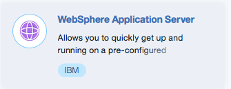

---

copyright:
  years: 2017, 2019
lastupdated: "2019-02-15"

---

{:shortdesc: .shortdesc}
{:new_window: target="_blank"}
{:codeblock: .codeblock}

# シングル・テナント環境へのアクセス
{: #singleTenantEnvironment}

次の手順では、シングル・テナント環境へのアクセス、およびサービス・インスタンスの作成方法について説明します。
{: shortdesc}

## シングル・テナント環境へのアクセス
{: #accessSTE}

1. ブラウザーで、[{{site.data.keyword.cloud_notm}} カタログ](https://{DomainName}/catalog/){: new_window}に移動します。

2. **「ログイン」**をクリックし、IBMid を使用してログインします。

6. カタログ検索フィルターで、**WebSphere Application Server** と入力します。

    

7. **「アプリケーション・サービス」**で、**「WebSphere Application Server」**タイルをクリックします。

    

8. **「環境」**メニューで、目的のシングル・テナント環境を選択します。

    

    **問題の回避:** デフォルトとしてパブリック環境が表示される場合があります。 正しい環境名を表示するには、正しい地域にログインしていること、およびシングル・テナント環境へのアクセスを許可された組織のメンバーであることが前提となります。

    **注:** パブリック環境のいずれかを選択する場合、時間単位の料金がかかる場合があります。 したがって、シングル・テナント環境の名前が表示されない場合、[ヘルプの利用](/docs/services/ApplicationServeronCloud?topic=wasaas-reporting_issues#reporting_issues){: new_window}ページの説明に従ってサポート・チケットをオープンします。

9. 適切なプランを選択し、**「作成」**をクリックします。

    

**注:** 時間単位の料金はシングル・テナント環境には適用されません。 シングル・テナント環境には、割り当て量と呼ばれる固定数の**ブロック**が含まれます。 小規模環境には 64 のブロックが含まれます。 中規模環境には 128 のブロックが含まれ、大規模環境には 256 のブロックが含まれます。

**ブロック**は、以下のように定義されます。
  * 1 つの vCPU
  * 12.5 GB のディスク [1]
  * 2 GB の RAM

[1] *技術的には、小規模システムには 12 GB のディスクのみ含まれます。 中規模システムには 25 GB のディスクが含まれ、大規模システムには 50 GB のディスクが含まれます (以下同様)。*

作成する仮想マシンごとに、目的の T シャツ・サイズを指定します。サイズは S、M、L、XL、XXL のいずれかで、これらはそれぞれ 1、2、4、8、および 16 のブロックに対応します。 T シャツ・サイズを選択すると、割り当て量から対応するブロック数が減算されます。

例えば、64 のブロックが含まれる小規模環境があるとします。 この環境内で、2 つの XXL、3 つの XL、および 1 つの L を含むサービス・インスタンスを構成しました。これにより、合計 60 のブロックが使用されます。 新しい Liberty Core サブスクリプションに対して T シャツ・サイズ M (ミディアム) を選択すると、割り当て量と使用可能なブロック数を示すメッセージが表示されます。

> **このサービスのシングル・テナントのメモリー割り当て量は 64 ブロックです。 現在の構成を含め、残りは 2 ブロックです。 メモリー割り当て量を増やす場合、IBM 営業担当員にお問い合わせください。**

## プライベート・ネットワーク環境
{: #private_network}

シングル・テナント環境がプロビジョンされた後、VPN 資格情報をダウンロードして OpenVPN 接続を確立できます。 詳しくは、以下のリンクを参照してください。

* [VPN アクセス](/docs/services/ApplicationServeronCloud?topic=wasaas-networkEnvironment#vpnAccess){: new_window}
* [OpenVPN のセットアップ](/docs/services/ApplicationServeronCloud?topic=wasaas-system_access#setup_openvpn){: new_window}

## シングル・テナント環境の管理
{: #manageSTE}

既存のシングル・テナント環境に容量を追加するには、または別のデータ・センターで容量をオーダーするには、米国コール・センター、地方の IBM 担当員、または IBM ビジネス・パートナーにお問い合わせください。 詳細については、[営業担当員へのお問い合わせ](/docs/services/ApplicationServeronCloud?topic=wasaas-reporting_issues#contacting-sales)を参照してください。
