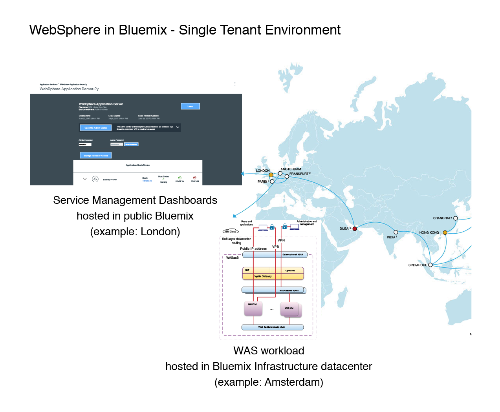

---

copyright:
  years: 2017, 2018
lastupdated: "2018-10-25"

---

{:shortdesc: .shortdesc}
{:new_window: target="_blank"}
{:codeblock: .codeblock}

# Single Tenant Environment
{: #getting_startedSTE}

{{site.data.keyword.appserver_full}}: Single Tenant Environment는 격리된 WebSphere 워크로드, 완전히 통합된 하이브리드 환경, 보안 데이터를 고객에게 제공합니다. 이 시작하기 안내서는 {{site.data.keyword.Bluemix_notm}}: Single Tenant Environment에서 클라이언트가 WebSphere Application Server에 액세스하고 이를 관리하는 데 도움이 되는 주요 요소를 식별하도록 설계되었습니다.
{: shortdesc}

## Single Tenant Environment 주문
{:#ordering}

Single Tenant Environment는 {{site.data.keyword.Bluemix_notm}} 카탈로그를 통해 작성할 수 없으며, IBM 영업 담당자에게 문의하여 주문해야 합니다. 환경을 주문하는 경우 표준 또는 BYOL(Bring-Your-Own-License) Single Tenant Environment 중에서 선택할 수 있습니다. 표준 Single Tenant Environment는 필요한 모든 인프라 및 WebSphere Application Server 라이센스를 포함합니다. BYOL(Bring-Your-Own-License) Single Tenant Environment를 사용하면 별도의 WebSphere Application Server 라이센스를 사용할 수 있습니다.

Single Tenant Environment를 주문하려면 [IBM 영업 담당자에게 문의](reportingIssues.html#contacting-sales)하십시오. 영업 팀은 필요에 따라 조정된 환경을 설정하는 데 도움을 드릴 수 있습니다.

## WebSphere Application Server in {{site.data.keyword.Bluemix_notm}}: Single Tenant Environment의 개요
{: #overviewSTE}

WebSphere Application Server in {{site.data.keyword.Bluemix_notm}}: Single Tenant 오퍼링은 고객에게 고유의 개인 서비스 인스턴스, 개인 네트워킹 및 격리된 리소스를 제공합니다. 이 오퍼링은 독립적으로 관리되지만 서비스 및 작성된 서비스 인스턴스 대시보드는 다음 그림에 표시된 대로 특정 {{site.data.keyword.Bluemix_notm}} 공용 지역을 통해 액세스할 수 있습니다.

그림 1. WebSphere Application Server in {{site.data.keyword.Bluemix_notm}}: Single Tenant Environment의 아키텍처

## 조직 관리
{: #organization_management}

WebSphere Application Server in {{site.data.keyword.Bluemix_notm}}: Single Tenant Environment는 사용자 주문에 따라 구성됩니다. 하나 이상의 {{site.data.keyword.Bluemix_notm}} 조직 이름을 주문의 일부로 제공한 경우 지금 사용자 환경에 액세스할 수 있습니다. 하나 이상의 조직 이름을 제공하지 않았거나 이 설정을 변경하려는 경우 사용자 지역의 {{site.data.keyword.Bluemix_notm}} 콘솔에서 **애플리케이션 서비스**에 대한 [지원 티켓](reportingIssues.html#reporting_issues)을 여십시오. 조직 이름(ORG)은 다음 그림에 표시된 대로 {{site.data.keyword.Bluemix_notm}} 콘솔의 오른쪽 상단에 있습니다.

그림 2. 조직 이름의 위치

**참고:** Single Tenant Environment에 액세스하려면 [Single Tenant Environment 액세스](singleTenantAccess.html#singleTenantEnvironment)를 참조하십시오.
