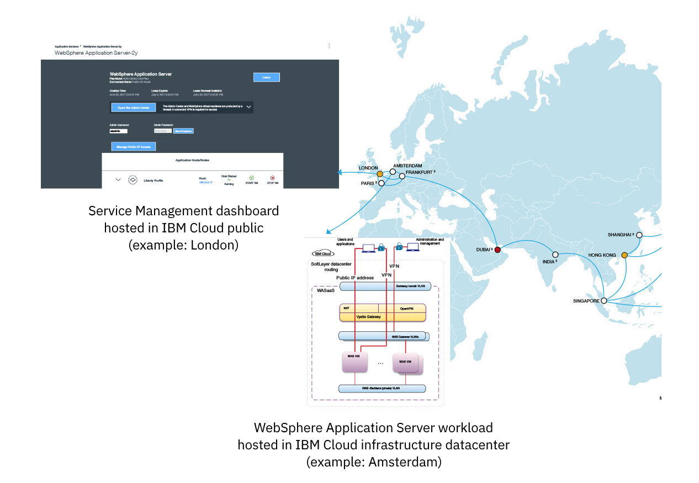

---

copyright:
  years: 2017, 2019
lastupdated: "2019-02-15"

keywords: single tenant, websphere, sales, order

subcollection: wasaas

---

{:shortdesc: .shortdesc}
{:new_window: target="_blank"}
{:codeblock: .codeblock}

# Ambiente de locatário único
{: #getting_startedSTE}

O Ambiente de Locatário Único do {{site.data.keyword.appserver_full}} fornece aos clientes uma carga de trabalho isolada do WebSphere, um ambiente híbrido totalmente integrado e dados seguros. Este guia de introdução foi projetado para identificar elementos chave que auxiliam no acesso e gerenciamento de seu Ambiente de Locatário Único.
{: shortdesc}

## Solicitando um ambiente de locatário único
{:#ordering}

Os ambientes de locatário único não podem ser criados por meio do catálogo do {{site.data.keyword.Bluemix_notm}} e devem ser solicitados entrando em contato com Vendas IBM. Ao solicitar o ambiente, é possível escolher um ambiente de locatário único padrão ou com sua própria licença. Os ambientes de locatário único padrão incluem toda a infraestrutura necessária e as licenças do WebSphere Application Server. Em Ambientes de Locatário Únicos de licença própria, é possível usar licenças separadas do WebSphere Application Server.

Para pedir um Ambiente de locatário único, [entre em contato com a equipe de Vendas da IBM](/docs/services/ApplicationServeronCloud?topic=wasaas-reporting_issues#contacting-sales). A equipe de vendas pode auxiliá-lo na configuração de um ambiente que seja customizado para suas necessidades.

## Visão geral do WebSphere Application Server no Ambiente de Locatário Único do {{site.data.keyword.Bluemix_notm}}
{: #overviewSTE}

O Ambiente de Locatário Único é sua própria instância privada do serviço, rede privada e recursos isolados. Embora a oferta seja gerenciada de forma independente, o serviço e os painéis de instância de serviço criados são acessíveis por meio de uma região pública específica do {{site.data.keyword.Bluemix_notm}}, conforme indicado na figura a seguir.

Figura 1. Arquitetura do WebSphere Application Server no Ambiente de Locatário Único do {{site.data.keyword.Bluemix_notm}}

## Gerenciamento de organização
{: #organization_management}

O WebSphere Application Server no Ambiente de Locatário Único do {{site.data.keyword.Bluemix_notm}} é configurado de acordo com seu pedido. Se você fornecer um ou mais nomes de organização do {{site.data.keyword.Bluemix_notm}} como parte do pedido, poderá iniciar o acesso ao seu ambiente agora. Se você não forneceu um nome de organização ou se deseja mudar essa configuração, abra um [chamado de suporte](/docs/services/ApplicationServeronCloud?topic=wasaas-reporting_issues#reporting_issues) para **Application Services** no console do {{site.data.keyword.Bluemix_notm}} de sua região. É possível localizar o nome da organização no console do {{site.data.keyword.Bluemix_notm}}, acessando **Gerenciar > Conta > Organizações do Cloud Foundry**.

**Nota:** para acessar seu Ambiente de locatário único, consulte [Acesso ao Ambiente de locatário único](/docs/services/ApplicationServeronCloud?topic=wasaas-singleTenantEnvironment#singleTenantEnvironment).
