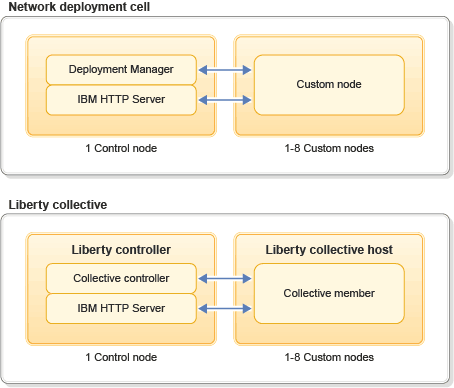

---

copyright:
  years: 2017, 2018
lastupdated: "2018-10-25"

---

{:shortdesc: .shortdesc}
{:new_window: target="_blank"}
{:codeblock: .codeblock}
{:tip: .tip}

# Sobre
{: #about}

O {{site.data.keyword.appserver_full}} facilita a configuração rápida em uma instância pré-configurada do WebSphere Application Server Liberty, do Traditional Network Deployment ou do Traditional WebSphere Java EE em um ambiente de nuvem hospedado no {{site.data.keyword.Bluemix_notm}}.
{: shortdesc}

## Visão geral do WebSphere Application Server no {{site.data.keyword.Bluemix_notm}}
{: #overview}

O WebSphere Application Server no {{site.data.keyword.Bluemix_notm}} fornece aos consumidores os servidores pré-configurados do WebSphere tradicional e do Liberty. Ele é hospedado em convidados da máquina
virtual com acesso raiz para o sistema operacional guest. Quando você estiver criando seu serviço, escolha entre _Liberty_, _Traditional ND_ ou _Traditional WebSphere_.

**Nota: ** os consumidores agora podem escolher entre o nível de fix pack atual ou uma versão mais antiga [(n ou n-1)](maintenanceAndUpdates.html#maintenance-strategy){: new_window} ao criar qualquer WebSphere Application Server na instância do {{site.data.keyword.Bluemix_notm}}.

Você recebe uma experiência de administração do WebSphere familiar e tem acesso completo
ao sistema operacional subjacente. É possível reutilizar seus scripts existentes e fazer pequenos ajustes de sistema
necessários para trabalhar com suas estruturas próprias ou de terceiros. O Centro do administrador e os Consoles do administrador são fornecidos para administrar o serviço WebSphere Application Server Liberty, ND ou Traditional, assim como suas configurações do WebSphere no local.

O WebSphere Application Server no {{site.data.keyword.Bluemix_notm}} Network Deployment Plan consiste em um ambiente de célula do WebSphere Application Server Network Deployment com duas ou mais máquinas virtuais. A primeira máquina virtual contém o Deployment Manager e o IBM HTTP Server e as máquinas virtuais restantes contêm nós customizados (agentes de nó) federados para o Deployment Manager. Use seus scripts wsadmin existentes para criar sua configuração do WebSphere ou use
o Console administrativo do WebSphere para configurar manualmente o ambiente. Esses novos recursos permitem que os usuários configurem um ambiente em cluster, o que é um aspecto crítico de qualquer aplicativo corporativo de middleware. Os
clientes agora podem optar por agrupar uma topologia para balancear a carga de solicitações entre duas ou mais Instâncias.

O WebSphere Application Server no plano de implementação de rede do {{site.data.keyword.Bluemix_notm}} também inclui o uso de um Liberty Collective. O Liberty Collective é um domínio administrativo para um grupo de perfis Liberty (servidores) e consiste em duas ou mais máquinas virtuais. A primeira máquina virtual contém o servidor Liberty do controlador coletivo, que é um ponto de controle para o Liberty Collective. Além do Liberty Collective, essa máquina virtual também contém o IBM HTTP Server, que permite o acesso a seus aplicativos de um navegador da web. As máquinas virtuais restantes são
os hosts coletivos em que os membros coletivos residem (servidores de perfil Liberty). O recurso Liberty Admin Center também está
ativado no servidor do controlador do Liberty.

A figura a seguir mostra a arquitetura do WebSphere Application Server em ambientes da célula de implementação de rede do {{site.data.keyword.Bluemix_notm}} e do Liberty collective.

Figura 1. Célula de implementação de rede e arquitetura Liberty Collective



**Nota**: na _Figura 1_ acima, o padrão que descreve a disposição do Deployment Manager ou do controlador coletivo com o IBM HTTP Server é destinado para propósitos de desenvolvimento e teste. O WebSphere Application Server no {{site.data.keyword.Bluemix_notm}} também oferece
a liberdade de reconfigurar o software pré-instalado para atender às necessidades operacionais e de aplicativo de produção; tal como você faria no
local. Além disso, para os requisitos de produção mais estritos, entre em contato com o representante de vendas IBM que poderá falar sobre a oferta de único locatário do IBM WebSphere Application Server no {{site.data.keyword.Bluemix_notm}}, que oferece recursos de rede e computação isolados.


## Ambiente operacional
{: #operational_environment}

O IBM WebSphere Application Server no {{site.data.keyword.Bluemix_notm}} é um serviço que retorna guests (máquinas virtuais) em um ambiente compartilhado para que os consumidores implementem aplicativos. Um VPN protege o serviço público de varreduras de portas genéricas e outros
ataques baseados em rede não solicitados. No entanto, é importante observar que a VPN de serviço que você usa para acessar
a sua instância de serviço pode ser compartilhada entre múltiplas organizações e usuários do
{{site.data.keyword.Bluemix_notm}}. As máquinas virtuais fornecem recursos de cálculo, de memória e de Entrada/Saída, os quais são provenientes de um conjunto compartilhado de recursos IaaS.

Como os recursos específicos de cálculo, de memória e de E/S são executados
por máquinas virtuais em um ambiente compartilhado, as configurações de serviço podem variar. As configurações para cada instância de serviço específica podem ser visualizadas por meio de painéis de serviço e portais do IBM WebSphere Application Server no {{site.data.keyword.Bluemix_notm}}.

O IBM WebSphere Application Server no {{site.data.keyword.Bluemix_notm}} fornece instâncias de máquina virtual. Com essas instâncias, os clientes usam um portal simples para criar e gerenciar implementações corporativas do WebSphere Application Server de uma forma consistente e repetida com flexibilidade significativa para ajustar seus aplicativos. Os usuários podem começar a trabalhar em máquinas virtuais pré-configuradas do WebSphere Application Server Liberty, ND ou Traditional em um ambiente de nuvem hospedado. Os usuários podem migrar aplicativos existentes do WebSphere Application Server para o {{site.data.keyword.Bluemix_notm}} e assumir o controle total do sistema operacional e do middleware subjacentes.

## Dimensionamento da máquina virtual
{: #vm-size}

O IBM WebSphere Application Server no {{site.data.keyword.Bluemix_notm}} fornece dimensionamento de camisetas para que você possa dimensionar os ambientes de maneira ideal para aplicativos de uso intensivo de memória, fornecendo máquinas virtuais maiores. Cada máquina virtual que você fornecer para executar o WebSphere Application Server poderá ser dimensionada independentemente de acordo com as necessidades de recursos esperadas.

As máquinas virtuais são dimensionadas e precificadas em *blocos*. Para cada bloco no tamanho da camiseta, a máquina virtual é fornecida com os recursos a seguir.
* 1 CPU virtual (vCPU)
* 2 GB de RAM
* 12,5 GB de espaço de disco rígido (12,0 GB para VMs de bloco único)


| Camiseta | Blocos | vCPU | RAM (GB) | HD (GB) |
|:-------:|:------:|:----------:|:--------------:|:-------------:|
| P | 1 | 1 | 2 | 12 |
| M | 2 | 2 | 4 | 25 |
| G | 4 | 4 | 8 | 50 |
| EG | 8 | 8 | 16 | 100 |
| EEG | 16 | 16 | 32 | 200 |
{: caption="Tabela 1. Bloqueios por tamanho de camiseta" caption-side="top"}

Cada servidor ou nó é fornecido em uma única máquina virtual. Por exemplo, no plano de implementação de rede, se você fornecer uma máquina virtual M (2 blocos) para o seu gerenciador de implementação e 8 máquinas virtuais S (1 bloco) para nós de aplicativos, você será cobrado por um total de 10 blocos.

## Opções de Faturamento
{: #billing-options}

A precificação para cada bloco dependerá da opção de faturamento que você escolher:
* ** [Pré-pago](#pay-as-you-go):** faturamento baseado em uso, precificado em horas por bloco usado
* **[Contrato de reserva](#reserve-contract):** assinaturas mensais pré-pagas de recursos reservados

### Pague o quanto for.
{: #pay-as-you-go}

A precificação pré-paga se aplicará se você fornecer o IBM WebSphere Application Server no serviço do {{site.data.keyword.Bluemix_notm}} sem entrar em contato com Vendas IBM para obter opções de faturamento alternativo. O uso é cobrado para a hora total ou parcial de cada bloco que é usado durante o período de faturamento mensal. O faturamento mínimo é configurado em 1/4 de uma hora de bloco.

**Nota**: devido a uma quantidade específica de recursos de computação, de memória e de E/S, as instâncias interrompidas são cobradas em uma taxa reduzida de 5% da taxa de bloco por hora. Dentro do serviço, as instâncias
interrompidas são limitadas a 10 endereços IP ou 64 GB de memória.

#### Precificação de

O preço por bloco varia dependendo do plano do WebSphere Application Server que você escolher.

A tabela a seguir lista o preço total por hora para cada máquina virtual do tamanho da camiseta. Os preços representam o IBM WebSphere Application Server em planos do {{site.data.keyword.Bluemix_notm}} a partir de 1º de abril de 2016 e estão listados em dólares americanos (USD). Consulte o catálogo para os preços atuais em sua região.

| Camiseta | Blocos | Liberty Core | Base do WAS | ND do WAS |
|:-------:|:------:|:----------:|:------:|:----------:|
| P | 1 | US$ 0,21 | US$ 0,30 |  US$ 0,70 |
| M | 2 | US$ 0,42 | US$ 0,60 |  US$ 1,40 |
| G | 4 | US$ 0,84 | US$ 1,20 |  US$ 2,80 |
| EG | 8 | US$ 1,68 | US$ 2,40 |  US$ 5,60 |
| EEG | 16 | US$ 3,36 | US$ 4,80 |  US$ 11,20 |
{: caption="Tabela 2. Plano do Liberty Core" caption-side="top"}


### Contrato reserva
{:#reserve-contract}

Com o faturamento do contrato de reserva, você compra uma assinatura mensal pré-paga que garante o acesso a blocos de recursos
computacionais fisicamente reservados. Esses blocos de serviço são reservados para o seu uso exclusivo e não podem ser considerados como capacidade disponível para qualquer outro WebSphere Application Server em usuários do {{site.data.keyword.Bluemix_notm}}. Se você tem licenças existentes do WebSphere Application Server, é possível usá-las ao escolher um contrato de reserva com sua própria licença, que tem uma taxa de faturamento reduzida. Para configurar o faturamento do contrato de reserva, [entre em contato com Vendas IBM](reportingIssues.html#contacting-sales).

Assinaturas estão disponíveis em incrementos de 8 blocos. As horas de bloco totais são baseadas no número de horas no mês, mas
é possível usar as horas de bloco a qualquer momento durante o mês. Por exemplo, um mês de 30 dias tem 720 horas que, quando multiplicadas por uma assinatura de 8 blocos, resulta em um total de 5.760 horas de bloco.

  ```
30 dias * 24 horas por dia * 8 blocos = 5.760 horas de bloco
  ```

É possível customizar como e quando usar os blocos para atender a demanda de carga de trabalho variável, como o uso de 4 blocos, aumentando para 12 blocos e, em seguida, reduzindo para 8 blocos. Contanto que você fique abaixo do total de horas de bloco do mês, não há nenhum encargo adicional.

É possível escolher usar os seus blocos do contrato de reserva ou usar o faturamento pré-pago ao provisionar cada ambiente.

**Nota:** se você excluir uma instância de serviço, poderá ter que esperar cerca de 30 minutos para que os blocos sejam disponibilizados para as novas instâncias de serviço.

#### Exagidades

Se o seu uso exceder as horas de bloco mensais em sua assinatura, o excedente será cobrado de acordo com o modelo de faturamento pré-pago, portanto, você será cobrado apenas pelas horas extras de bloco que usar. O uso de bloco é medido em uma base horária total ou parcial, com o uso mínimo em 1/4 de uma hora de bloco.

Os blocos do modelo pré-pago não são de capacidade reservada e vêm de um conjunto de recursos comuns.

#### Taxas de precificação para utilização flexível

Os blocos em faturamento de contrato de reserva são baseados no plano do WebSphere Application Server Network Deployment, mas
também é possível usar os blocos para outros planos. Com outros planos, o uso é rateado de forma que uma hora de bloco seja reduzida pela taxa de rateio do plano quando ela é refletida em suas horas de bloco do contrato de reserva restantes.

A tabela a seguir mostra as taxas de rateio para cada plano e o preço efetivo por hora de bloco real após o cálculo do rateio. Para preços atuais em sua região, [entre em contato com Vendas IBM](reportingIssues.html#contacting-sales).

| Plano | Taxa de precificação | Preço / hora após rateio |
|:-------:|:------:|:------:|
| WebSphere Application Server Liberty Core | 0,3 | US$ 0,21 |
| Base do WebSphere Application Server  | 0,43 | US$ 0,30 |
| WebSphere Application Server Network Deployment | 1,0 | US$ 0,70 |
{: caption="Tabela 3. Taxas de rateio de hora de bloco por plano" caption-side="top"}

Por exemplo, você pode ter uma instância M (2 blocos) do WebSphere Application Server Base que é executada por 51 horas. Para calcular as horas de bloco usadas de seu contrato de reserva, as horas de bloco reais são multiplicadas pela taxa de rateio, para um total de 43,86 horas de bloco:

```
2 blocks * 51 hours * 0.43 proration = 43.86 prorated block hours
```

O custo total permanece o mesmo, mas é possível usar mais horas de bloco reais dos planos rateados, pois eles deduzem menos de suas horas de bloco do contrato de reserva.
{:.tip}
