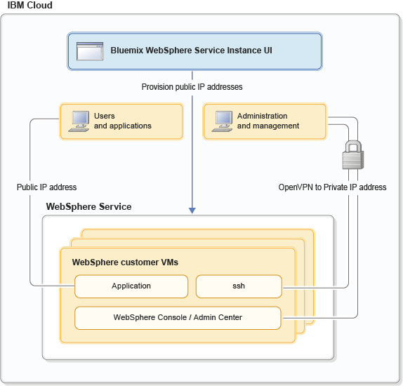

---

copyright:
  years: 2017, 2018
lastupdated: "2018-04-06"

---

{:shortdesc: .shortdesc}
{:new_window: target="_blank"}
{:codeblock: .codeblock}

# Ambiente de rede
{: #networkEnvironment}

Depois que a sua instância de serviço do {{site.data.keyword.appserver_full}} é fornecida, é possível
acessar a sua VM de várias maneiras. É possível se conectar por meio de uma VPN segura para obter o SSH, o WebSphere Admin Console tradicional e o acesso do aplicativo à sua VM. Também
é possível conectar sua VM à Internet com um endereço IP público.

O diagrama a seguir mostrar esses caminhos de rede:

Figura 1. Visualização do cliente de rede de diversos locatários com IP Público




## Acesso VPN
{: #vpnAccess}

Depois de provisionar um WebSphere Application Server na instância de serviço do {{site.data.keyword.Bluemix_notm}} do painel de serviço na UI do {{site.data.keyword.Bluemix_notm}}, é possível estabelecer uma conexão OpenVPN, expandindo o menu suspenso e fazendo download da configuração de VPN usando o botão **Download da configuração VPN**. A configuração de VPN contém um arquivo **.ovpn** e certificados que são usados para autenticar com o servidor OpenVPN. Depois que a conexão do OpenVPN for estabelecida, será possível acessar a sua VM por meio de SSH. Também
é possível acessar o Liberty Admin Center, o WebSphere Admin Console tradicional e aplicativos.

A configuração de VPN tem escopo definido para a sua organização e região. Ela é válida por um ano a partir do momento da
criação. Múltiplas conexões do cliente OpenVPN podem ser estabelecidas simultaneamente usando a mesma configuração de VPN.

**Nota:** a sua configuração de VPN é válida apenas se a sua organização contiver assinaturas **ativas**. Quando a última assinatura para uma organização for excluída, todas as configurações de VPN para a organização serão suspensas. Configurações de VPN não expiradas serão reativadas automaticamente quando uma nova assinatura se tornar ativa.

## Gerenciamento avançado de configuração de VPN
{: #advancedVPN}

Na maioria dos casos, é necessária apenas uma única configuração de VPN que possa ser transferida por download usando o botão **Download da configuração de VPN**. No entanto, a página de gerenciamento de VPN avançada, que é acessada usando o botão **Gerenciamento de VPN avançado** do painel de serviços na UI do {{site.data.keyword.Bluemix_notm}}, permite criar e gerenciar múltiplas configurações de VPN. Ter múltiplas configurações pode ser útil para fazer a transição suavemente para uma nova configuração de VPN quando a antiga estiver prestes a expirar. Também é possível solicitar múltiplas configurações de VPN para gerenciar o acesso às suas VMs com indivíduos ou equipes diferentes em sua organização.  

**Nota:** é permitido um **máximo** de 10 configurações de VPN ativas para a sua organização a qualquer momento.

Se as suas configurações de VPN estiverem comprometidas ou expiradas, será possível revogar a configuração de VPN usando a página de gerenciamento de VPN avançada. Além disso, em uma perspectiva de auditoria, é possível visualizar um histórico de todas as atividades de gerenciamento de VPN e fazer download de configurações de VPN ativas que foram criadas anteriormente por meio da página de gerenciamento de VPN avançada.

Todos os recursos disponíveis do painel de serviços na UI do {{site.data.keyword.Bluemix_notm}} também podem ter scripts usando as nossas APIs de REST. Para obter mais informações, consulte o WebSphere Application Server na {{site.data.keyword.Bluemix_notm}} [Documentação da API de REST](https://wasaas-broker.ng.bluemix.net/wasaas-broker/api#/){: new_window}.


## Acesso à Internet pública
{: #publicInternetAccess}

Opcionalmente, é possível gerenciar o acesso à Internet pública do painel de serviços na UI do {{site.data.keyword.Bluemix_notm}}. É possível **solicitar** um endereço IP público do conjunto e **abrir** a conexão da Internet com o WebSphere Application Server na instância de serviço do {{site.data.keyword.Bluemix_notm}}. Por outro lado, é possível **fechar** o acesso de sua instância de serviço para a Internet e **retornar** o endereço IP público para o conjunto.

Para **solicitar** um endereço IP público e **abrir** uma conexão, siga essas instruções:

1. Clique em **Gerenciar acesso de IP público** no painel de serviço na UI do {{site.data.keyword.Bluemix_notm}}.
2. O endereço IP para o host é mostrado, mas não o seu endereço IP público. Clique em  ** Solicitar Endereço IP Público **.

    **Nota:** você é levado de volta ao painel de serviço com um IP público designado. No entanto, a mensagem a seguir é exibida:

    >  ** O acesso está atualmente fechado. Clique em Gerenciar IP público para abrir acesso.**
3. Clique em **Gerenciar acesso de IP público** no painel de serviço na UI do {{site.data.keyword.Bluemix_notm}}.
4. Os endereços IP para o seu host e o seu novo IP público são mostrados, mas o acesso é fechado. Clique em  ** Abrir Acesso **.

    **Nota:** você é levado de volta ao painel de serviço com a seguinte mensagem exibida:

    > **Atualmente o acesso está aberto. Clique em Gerenciar IP público para fechar acesso. **

Para **fechar** uma conexão e **retornar** um endereço IP público, siga essas instruções:

1. Clique em **Gerenciar acesso de IP público** no painel de serviço na UI do
{{site.data.keyword.Bluemix_notm}}.
2. Clique em  ** Fechar Acesso **.

    **Nota:** você é levado de volta ao painel de serviço com a seguinte mensagem exibida:

    >  ** O acesso está atualmente fechado. Clique em Gerenciar IP público para abrir acesso.**
3. Clique em **Gerenciar acesso de IP público** no painel de serviço na UI do {{site.data.keyword.Bluemix_notm}}.
4. Clique em  ** Retornar Endereço IP Público **.

    **Nota:** você é levado de volta ao painel de serviço no qual o endereço IP do seu host é mostrado com a seguinte mensagem exibida:

    >  ** IP Público Retornado. **

## Portas IP Públicas
{: #publicIPports}

Ao abrir acesso ao seu IP público, o endereço IP será associado à sua VM, e as portas 80 e 443 serão abertas no gateway. No entanto, por padrão, os servidores Liberty Core e WebSphere Base tradicionais não abrem as portas 80 e 443. Pelo contrário, as portas 80 e 443 são abertas por padrão no IBM HTTP Server. Portanto, pode ser necessário configurar seus servidores Liberty Core e WebSphere Base tradicional para atender ao tráfego de aplicativo na porta 80/443 ao usar um IP público.
* Para configurar seu servidor Liberty Core, consulte [Configurar Servidor Liberty Core para acesso público](networkEnvironment.html#configureLibertyForPublicAccess).
* Para configurar seu servidor WebSphere Base tradicional, inclua uma cadeia de transporte de contêiner de web que atenda à porta 80/443, conforme descrito em [Configurando cadeias de transporte](http://www.ibm.com/support/knowledgecenter/SSEQTP_8.5.5//com.ibm.websphere.nd.doc/ae/trun_chain_transport.html){: new_window}.

**Evite problemas:** o Linux reserva portas menores que 1024 para usuários privilegiados, como **raiz**. No entanto, é uma prática comum executar servidores WebSphere Base tradicionais como um usuário **não raiz**. Portanto, ao incluir uma cadeia de transporte de contêiner da web, mude a configuração de **iptables** como o usuário **raiz**. Especificamente, redirecione as portas restritas 80 e 443 para outra porta acima de 1024,
como 9080 e 9443. Os comandos a seguir fornecem um exemplo desse processo:

```
-bash-4.1# sudo iptables -t nat -A PREROUTING -p tcp --dport 80 -j REDIRECT --to-port 9080
-bash-4.1# sudo iptables -I INPUT -p tcp -m tcp --dport 80 -j ACCEPT
-bash-4.1# sudo iptables -I INPUT -p tcp -m tcp --dport 9080 -j ACCEPT

-bash-4.1# sudo iptables -t nat -A PREROUTING -p tcp --dport 443 -j REDIRECT --to-port 9443
-bash-4.1# sudo iptables -I INPUT -p tcp -m tcp --dport 443 -j ACCEPT
-bash-4.1# sudo iptables -I INPUT -p tcp -m tcp --dport 9443 -j ACCEPT
```

** Nota: **  As mudanças em  ** iptables **  são efêmeras. Por exemplo, se o seu guest for reinicializado ou se o serviço **iptables** for reiniciado, as regras serão automaticamente liberadas e reconfiguradas. Para salvar as regras para que elas sejam persistidas quando o serviço iptables for iniciado ou o guest for reinicializado, use o comando a seguir como o usuário **raiz**:

```
-bash-4.1# service iptables save
iptables: Saving firewall rules to /etc/sysconfig/iptables:[  OK  ]

bash-4.1# cat /etc/sysconfig/iptables
# Generated by iptables-save v1.4.7 on Wed May 31 19:44:11 2017
*nat
:PREROUTING ACCEPT [0:0]
:POSTROUTING ACCEPT [23:1706]
:OUTPUT ACCEPT [23:1706]
-A PREROUTING -p tcp -m tcp --dport 80 -j REDIRECT --to-ports 9080
-A PREROUTING -p tcp -m tcp --dport 443 -j REDIRECT --to-ports 9443
COMMIT
# Completed on Wed May 31 19:44:11 2017
# Generated by iptables-save v1.4.7 on Wed May 31 19:44:11 2017
*filter
:INPUT DROP [0:0]
:FORWARD DROP [0:0]
:OUTPUT DROP [0:0]
-A INPUT -p tcp -m tcp --dport 9443 -j ACCEPT
-A INPUT -p tcp -m tcp --dport 443 -j ACCEPT
-A INPUT -p tcp -m tcp --dport 9080 -j ACCEPT
-A INPUT -p tcp -m tcp --dport 80 -j ACCEPT

```


**Nota:** **iptables** são chamadas em solicitações que viajam sobre a interface externa do guest. As solicitações que viajam sobre o loopback local (127.0.0.1) não são processadas por **iptables**, portanto, as portas de redirecionamento, conforme observado anteriormente, não seriam chamadas de loopback.

## Portas IP privadas da VPN
{: #privateIPports}

Você se conecta ao endereço IP privado da VM por meio da conexão VPN. O Liberty Admin Center (9080, 9443), o WebSphere Admin Console tradicional (9060, 9043), o SSH (22) e as portas
diferentes de 80/443 são acessíveis somente por meio da conexão VPN, conforme ilustrado na Figura 1. Consulte os arquivos **server.xml** e **ibm-web-bnd.xml** de amostra do Liberty Core para obter detalhes sobre separar o Liberty Admin Center das portas do seu aplicativo.

**Evite problemas:** para servidores Liberty Core e WebSphere Base tradicional, as portas do Firewall são pré-configuradas quando sua VM é provisionada. No entanto, para configurações do Network Deployment nas quais o Gerenciador de Implementação ou o Controlador Coletivo estão instalados com o IBM HTTP Server, pode ser necessário abrir portas no firewall. Consulte [Portas de firewall](systemAccess.html#firewall_ports) para detalhes.

## Configurando um servidor Liberty Core para um acesso de IP público
{: #configureLibertyForPublicAccess}

É necessário configurar o Liberty Core para atender ao tráfego de aplicativo na porta 80/443 ao usar o IP público.

Por padrão, o Liberty é configurado com o Liberty Admin Center e aplicativos disponíveis no host virtual **default_host**, associado ao **defaultHttpEndpoint** nas portas 9080 e 9443. Reconfigure seu servidor para separar o Liberty Admin Center do host virtual do aplicativo e do terminal e disponibilize-os em portas separadas.

O snippet a seguir é um exemplo dos ajustes da configuração de server.xml:

```    
    <!-- open port 9080/9443 for incoming http connections -->
    <httpEndpoint id="defaultHttpEndpoint"
        host="*"
        httpPort="9080"
        httpsPort="9443">
        <tcpOptions soReuseAddr="true"/>
    </httpEndpoint>

    <!-- define a new endpoint for public app traffic -->
    <httpEndpoint id="publicHttpEndpoint"
        host="*"
        httpPort="80"
        httpsPort="443">
        <tcpOptions soReuseAddr="true"/>
    </httpEndpoint>

    <!–- restrict default_host to vpn so the Liberty Admin Center is not public -->
    <virtualHost id="default_host" allowFromEndpointRef="defaultHttpEndpoint">
      <hostAlias>*:9080</hostAlias>
      <hostAlias>*:9443</hostAlias>
    </virtualHost>

    <virtualHost id="external_host">
      <hostAlias>*:80</hostAlias>
      <hostAlias>*:443</hostAlias>
    </virtualHost>
```
{: codeblock}

Agora, associe o seu aplicativo ao host virtual **external_host** incluindo o fragmento a seguir no arquivo **WEB-INF/ibm-web-bnd.xml** do aplicativo:

```
    <?xml version="1.0" encoding="UTF-8"?>
    <web-bnd
        xmlns="http://websphere.ibm.com/xml/ns/javaee"
        xmlns:xsi="http://www.w3.org/2001/XMLSchema-instance"
        xsi:schemaLocation="http://websphere.ibm.com/xml/ns/javaee   
        http://websphere.ibm.com/xml/ns/javaee/ibm-web-bnd_1_0.xsd"
        version="1.0">

        <virtual-host name="external_host" />
    </web-bnd>
```
{: codeblock}

## Configurando o DNS
{: #dnsConfig}

É importante observar que o WebSphere Application Server em VMs do {{site.data.keyword.Bluemix_notm}} são configurados com dois resolvedores de DNS. Os resolvedores são configurados no arquivo **/etc/resolv.conf** na VM. O servidor DNS primário é um servidor não autorizado fornecido pelo WebSphere Application Server no serviço do {{site.data.keyword.Bluemix_notm}}. O servidor DNS secundário é um servidor não autorizado fornecido pelo {{site.data.keyword.Bluemix_notm}}.

Recomendamos que você revise a configuração do DNS para ver se ela se ajusta às suas necessidades. É possível atualizar o arquivo **/etc/resolv.conf** para referenciar o servidor DNS de sua escolha se os fornecidos pela IBM não atenderem aos seus requisitos.

**Nota:** o WebSphere Application Server mais antigo nas VMs do {{site.data.keyword.Bluemix_notm}} pode ter apenas um servidor DNS primário configurado no arquivo **/etc/resolv.conf**. Se desejar uma solução de alta disponibilidade, libere a VM e forneça uma nova ou atualize o arquivo **/etc/resolv.conf** para incluir um servidor DNS secundário. Pode ser o seu servidor DNS preferencial ou o fornecido pelo {{site.data.keyword.Bluemix_notm}} (10.0.80.11).


## Abrindo portas para novos servidores em nós customizados
{: #serversOnCustom}

Ao criar um servidor em um nó customizado, as portas adicionais que são necessárias pelo servidor devem ser abertas no gerenciador de implementação e nas VMs do nó customizado antes de iniciar o servidor. Depois de criar o servidor, mas antes de
iniciar o servidor, abra as portas executando o script `openWASPorts.sh`:

 1. Efetue login em cada gerenciador de implementação e VM customizada como o usuário raiz.
 1. Execute o script `/opt/IBM/WebSphere/AppServer/virtual/bin/openWASPorts.sh` para abrir as portas.
 
Depois de executar o script, é possível iniciar o servidor do console administrativo do Deployment Manager.
