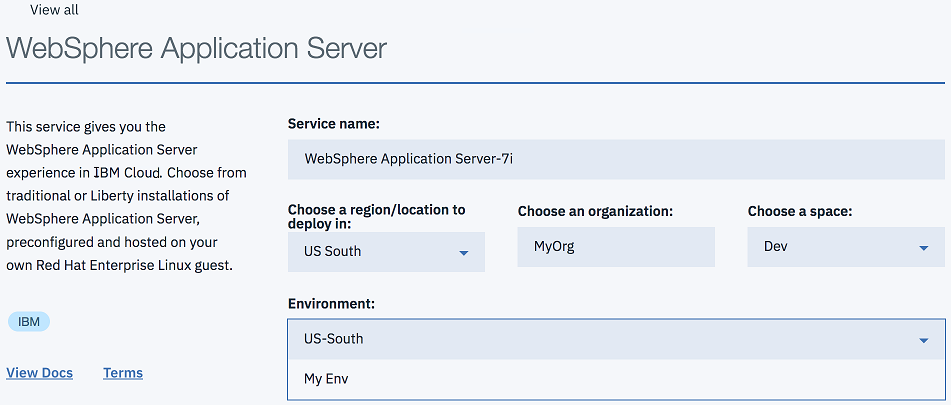

---

copyright:
  years: 2017, 2018
lastupdated: "2018-11-19"

---

{:shortdesc: .shortdesc}
{:new_window: target="_blank"}
{:codeblock: .codeblock}

# Acesso ao Ambiente Único do Locatário
{: #singleTenantEnvironment}

As etapas a seguir discutem o acesso ao ambiente de locatário único, juntamente com os métodos de criação
de uma instância de serviço.
{: shortdesc}

## Acessando seu Ambiente de Locatário Único
{: #accessSTE}

1. Em seu navegador, acesse o [Catálogo do {{site.data.keyword.cloud_notm}}](https://{DomainName}/catalog/){: new_window}.

2. Clique em **Efetuar login** e efetue login com o seu IBMid.

6. No filtro de procura do catálogo, insira **WebSphere Application Server**.

    

7. Em **Application Services**, clique no quadro do **WebSphere Application Server**.

    

8. No menu **Ambiente**, selecione o seu ambiente de locatário único.

    

    **Evite problemas:** o ambiente público pode ser mostrado como o padrão. A exibição do nome do ambiente correto assume que você está com login efetuado na região correta e um membro de uma organização que tem permissão para acessar o seu ambiente de locatário único.

    **Nota:** se você selecionar um dos ambientes públicos, poderá haver um encargo por hora. Portanto, se você não vir seu nome de Ambiente de Locatário Único, abra um Chamado de Suporte, conforme descrito na página [Obtendo ajuda](reportingIssues.html){: new_window}.

9. Selecione o plano apropriado e clique em **Criar**.

    

**Nota:** a precificação por hora não se aplica a ambientes de locatário único. Um ambiente de locatário único inclui um número fixo de **blocos** que são chamados de cota. Um ambiente pequeno contém 64 blocos. Um médio contém 128 blocos e um grande contém 256 blocos.

Um **bloco** é definido conforme a seguir.
  * 1 vCPU
  * Disco de 12,5 GB [ 1 ]
  * 2 GB de RAM

[1] *Tecnicamente, um sistema pequeno contém apenas 12 GB de disco. Um sistema de mídia contém 25 GB de disco, um grande contém 50 GB e assim por diante. *

Para cada máquina virtual criada, especifique o tamanho que você deseja: S, M, L, XL ou XXL, que corresponde a 1,
2, 4, 8 e 16 blocos. Ao selecionar um tamanho, o número de blocos correspondente é diminuído da sua cota.

Por exemplo, suponha que você tenha um ambiente pequeno, que contenha 64 blocos. Nesse ambiente, você configurou instâncias de
serviço que contêm duas XXLs, três XLs e 1 L para um total de 60 blocos usados. Se você selecionar um tamanho médio para uma nova assinatura do Liberty Core, uma mensagem poderá ser exibida, que indica a sua cota e o número de blocos ainda disponíveis:

> **A sua cota de memória de único locatário para esse serviço é de 64 blocos. Incluindo a sua configuração atual, você tem 2 blocos restantes. Para aumentar a cota de memória, entre em contato com Vendas IBM. **

## Ambiente de Rede Privado
{: #private_network}

Após seu Ambiente de Locatário Único ser provisionado, é possível fazer download de suas credenciais de VPN e estabelecer uma conexão OpenVPN. Para obter mais informações, consulte os links a seguir:

* [ Acesso VPN ](networkEnvironment.html#vpnAccess){: new_window}
* [ Configurando OpenVPN ](systemAccess.html#setup_openvpn){: new_window}

## Gerenciando seu Ambiente de Locatário Único
{: #manageSTE}

Para incluir capacidade extra em seu Ambiente de Locatário Único existente ou para solicitar capacidade em outro data center, entre em contato com as Centrais de Atendimento das Américas, o representante IBM local ou o Parceiro de Negócios IBM. Consulte [Contatando vendas](reportingIssues.html#contacting-sales) para obter detalhes.
