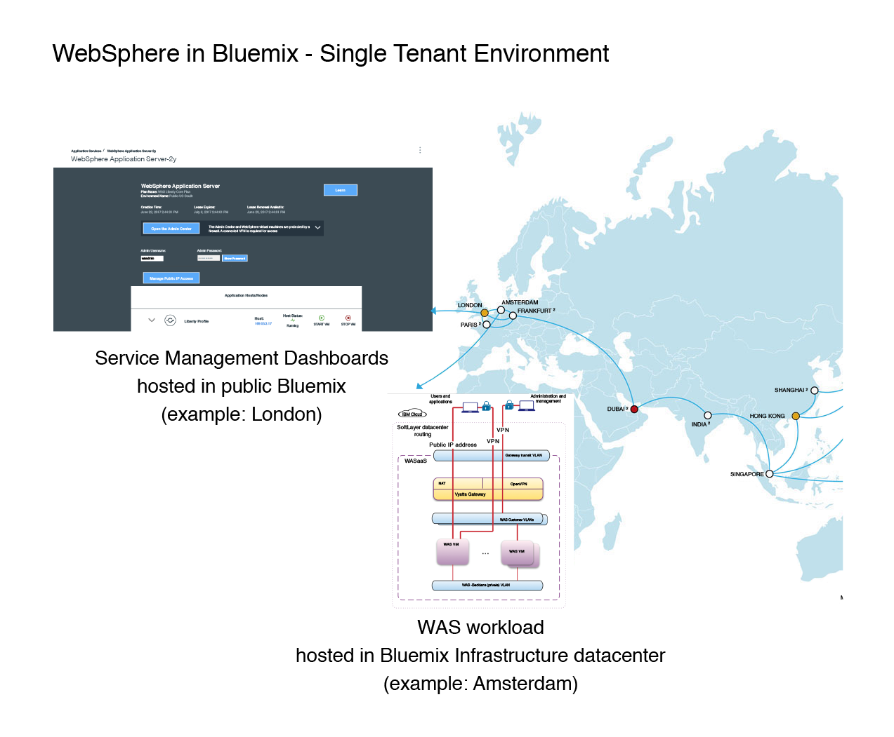

---

copyright:
  years: 2017, 2018
lastupdated: "2018-10-25"

---

{:shortdesc: .shortdesc}
{:new_window: target="_blank"}
{:codeblock: .codeblock}

# Single Tenant Environment
{: #getting_startedSTE}

{{site.data.keyword.appserver_full}}: Single Tenant Environment 为客户提供隔离的 WebSphere 工作负载、完全集成的混合环境和安全数据。本入门指南旨在确定有助于客户在 {{site.data.keyword.Bluemix_notm}}: Single Tenant Environment 中访问和管理自己的 WebSphere Application Server 的关键元素。
{: shortdesc}

## 订购 Single Tenant Environment
{:#ordering}

Single Tenant Environment 无法通过 {{site.data.keyword.Bluemix_notm}} 目录创建，必须通过联系 IBM 销售人员订购。订购环境时，您可以选择标准或自带许可证的 Single Tenant Environment。标准的 Single Tenant Environment 包括所有所需的基础架构和 WebSphere Application Server 许可证。自带许可证的 Single Tenant Environment 支持您使用单独的 WebSphere Application Server 许可证。

要订购 Single Tenant Environment，请[联系 IBM 销售人员](reportingIssues.html#contacting-sales)。销售团队可以协助您设置根据您的需要而定制的环境。

## WebSphere Application Server in {{site.data.keyword.Bluemix_notm}}: Single Tenant Environment 概述
{: #overviewSTE}

WebSphere Application Server in {{site.data.keyword.Bluemix_notm}}: Single Tenant Environment 产品为使用者提供了自己的专用服务实例、专用网络和隔离资源。虽然该产品是独立管理的，但服务和所创建服务实例的仪表板可以通过特定 {{site.data.keyword.Bluemix_notm}} 公共区域进行访问，如下图中所示：

图 1. WebSphere Application Server in {{site.data.keyword.Bluemix_notm}}: Single Tenant Environment 的体系结构

## 组织管理
{: #organization_management}

WebSphere Application Server in {{site.data.keyword.Bluemix_notm}}: Single Tenant Environment 是根据您的订单配置的。如果在订单中提供了一个或多个 {{site.data.keyword.Bluemix_notm}} 组织名称，那么可以立即开始访问环境。如果未提供一个或多个组织名称，或者如果要更改此设置，请在您所在区域的 {{site.data.keyword.Bluemix_notm}} 控制台中，开具**应用程序服务**的[支持凭单](reportingIssues.html#reporting_issues)。组织名称 (ORG) 可以在 {{site.data.keyword.Bluemix_notm}} 控制台的右上角找到，如下图中所示：

图 2. 组织名称的位置

**注：**要访问您的 Single Tenant Environment，请参阅 [Single Tenant Envir onment 访问](singleTenantAccess.html#singleTenantEnvironment)。
