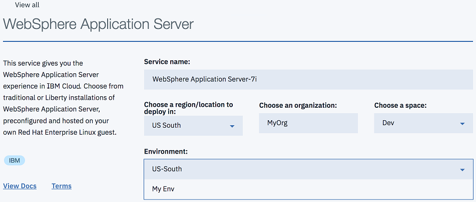
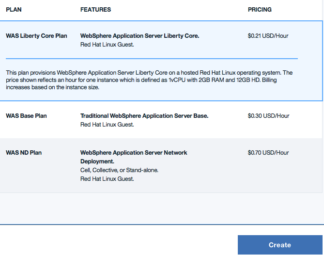

---

copyright:
  years: 2017, 2018
lastupdated: "2018-06-08"

---

{:shortdesc: .shortdesc}
{:new_window: target="_blank"}
{:codeblock: .codeblock}

# Single Tenant Environment 访问
{: #singleTenantEnvironment}

以下各步骤讨论如何访问 Single Tenant Environment 以及创建服务实例的方法。
{: shortdesc}

## 访问 Single Tenant Environment
{: #accessSTE}

1. 在浏览器中，转至 [{{site.data.keyword.cloud_notm}} 目录](https://console.bluemix.net/catalog/){: new_window}。

2. 单击**登录**，然后使用您的 IBM 标识登录。

6. 在目录搜索过滤器中，输入 **WebSphere Application Server**。

    

7. 在**应用程序服务**下，单击 **WebSphere Application Server** 磁贴。

    

8. 在**环境**菜单中，选择您的 Single Tenant Environment。

    

    **应避免的问题：**公共环境可能显示为缺省值。显示正确的环境名称将假定您已登录到正确的区域，并且允许组织的某个成员访问您的 Single Tenant Environment。

    **注：**如果选择其中一个公共环境，那么可能会发生每小时费用。因此，如果看不到您的 Single Tenant Environment 名称，请开具支持凭单，如[获取客户支持](https://console.bluemix.net/docs/support/index.html#contacting-support){: new_window}页面上所定义。

9. 选择相应的套餐，然后单击**创建**。

    

**注：**每小时定价不适用于 Single Tenant Environment。Single Tenant Environment 包含固定数量的**块**，这称为配额。小型环境包含 64 个块。中型环境包含 128 个块，大型环境包含 256 个块。

**块**的定义如下：
  * 1 个 vCPU
  * 12.5 GB 磁盘[1]
  * 2 GB RAM

[1] *在技术上，小型系统仅包含 12 GB 磁盘。中型系统包含 25 GB 磁盘，大型系统包含 50 GB 磁盘，依此类推。*

对于您创建的每个虚拟机，指定所需的 T 恤尺寸：S、M、L、XL 或 XXL，分别对应于 1、2、4、8 和 16 个块。选择 T 恤尺寸时，将从配额中递减相应的块数。

例如，假设您有一个小型环境，包含 64 个块。在此环境中，您配置的服务实例包含 2 个 XXL、3 个 XL 和 1 个 L，总共使用了 60 个块。如果为新的 Liberty Core 预订选择中号 T 恤尺寸，那么可能会显示一条消息，指示配额及仍然可用的块数：

> **此服务的单租户内存配额为 64 个块。根据当前配置，您还剩余 2 个块。要增加内存配额，请联系 IBM 销售人员。**

## 专用网络环境
{: #private_network}

供应 WebSphere Application Server in {{site.data.keyword.Bluemix_notm}}: Single Tenant Environment 之后，您可以下载 VPN 凭证并建立 OpenVPN 连接。有关更多信息，请参阅以下链接：

* [VPN 访问](https://console.bluemix.net/docs/services/ApplicationServeronCloud/networkEnvironment.html#vpnAccess){: new_window}
* [设置 OpenVPN](https://console.bluemix.net/docs/services/ApplicationServeronCloud/systemAccess.html#setup_openvpn){: new_window}

## 管理 Single Tenant Environment
{: #manageSTE}

要向现有 WebSphere Application Server in {{site.data.keyword.Bluemix_notm}}: Single Tenant Environment 添加额外容量或订购其他数据中心的容量，请联系美洲呼叫中心、当地 IBM 代表或您的 IBM 业务合作伙伴。要识别代表或合作伙伴，请拨打 800-426-4968。有关更多信息，请联系美洲呼叫中心。电话：800-IBM-CALL (426-2255) 传真：800-2IBM-FAX (242-6329)。

## 支持 Single Tenant Environment
{: #supportingSTE}

如果遇到问题，您可以开具支持凭单来获取帮助，如[获取客户支持](https://console.bluemix.net/docs/support/index.html#contacting-support){: new_window}页面上所定义。
