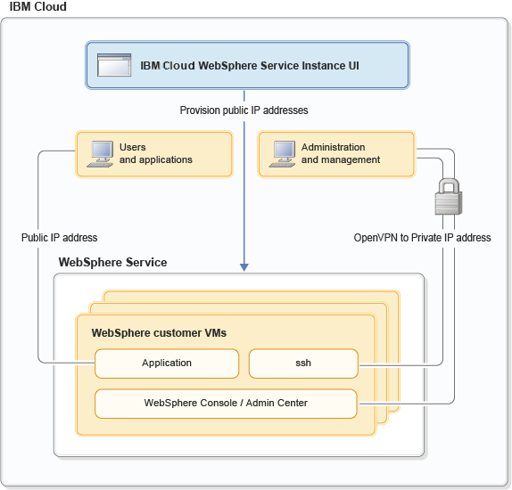

---

copyright:
  years: 2017, 2019
lastupdated: "2019-02-15"

keywords: public ip, vpn, private ip, dns, port, custom vm

subcollection: wasaas

---

{:shortdesc: .shortdesc}
{:new_window: target="_blank"}
{:codeblock: .codeblock}

# 網路環境
{: #networkEnvironment}

佈建 {{site.data.keyword.appserver_full}} 服務實例之後，您可以使用數種方式存取 VM。您可以透過安全的虛擬私密網路 (VPN) 連接，以便取得 VM 的 SSH、傳統 WebSphere 管理主控台及應用程式存取。您也可以使用公用 IP 位址將 VM 連接至網際網路。

下圖顯示這些網路路徑：

圖 1. 使用公用 IP 的多方承租戶用戶端畫面



## VPN 存取
{: #vpnAccess}

在 {{site.data.keyword.Bluemix_notm}} 使用者介面中，從服務儀表板佈建 WebSphere Application Server in {{site.data.keyword.Bluemix_notm}} 服務實例之後，您可以建立 OpenVPN 連線。若要建立連線，請展開下拉功能表並按一下**下載 VPN 配置**，以便下載您的 VPN 配置。VPN 配置包含 `.ovpn` 檔案，以及用來向 OpenVPN 伺服器進行鑑別的憑證。建立 OpenVPN 連線之後，您接著可以透過 SSH 存取 VM。您也可以存取「Liberty 管理中心」、傳統「WebSphere 管理主控台」，以及應用程式。

VPN 配置的範圍限定為您的組織及地區。從建立時間算起的一年內有效。您可以使用相同的 VPN 配置同時建立多個 OpenVPN 用戶端連線。

**附註：**只有在您的組織包含**作用中**訂閱時，VPN 配置才有效。刪除組織的最後一個訂閱後，即會暫停組織的所有 VPN 配置。新的訂閱變成作用中時，會自動重新啟動未過期的 VPN 配置。

## 進階 VPN 配置管理
{: #advancedVPN}

在大部分情況下，您只需要可使用**下載 VPN 配置**按鈕來下載的單一 VPN 配置。不過，您可以按一下服務儀表板上的**進階 VPN 管理**以存取進階 VPN 管理頁面，它會讓您建立及管理多個 VPN 配置。舊 VPN 配置即將到期時，具有多個配置可能有助於平順地轉移至新的 VPN 配置。您也可以要求多個 VPN 配置，以管理 VM 與組織中不同個人或團隊的存取權。  

**附註：**您隨時可以對組織使用**最多** 10 個作用中 VPN 配置。

如果您的 VPN 配置受損或過期，則可以使用進階 VPN 管理頁面來撤銷 VPN 配置。此外，從審核角度而言，您可以檢視所有 VPN 管理活動的歷程，以及下載先前從進階 VPN 管理頁面建立的作用中 VPN 配置。

使用 REST API，也可以對 {{site.data.keyword.Bluemix_notm}} 使用者介面之服務儀表板中可用的所有特性進行 Script 化。如需相關資訊，請參閱 WebSphere Application Server in {{site.data.keyword.Bluemix_notm}} [REST API 文件](https://wasaas-broker.us-south.websphereappsvr.cloud.ibm.com/wasaas-broker/api#/){: new_window}。


## 公用網際網路存取
{: #publicInternetAccess}

您可以選擇從 {{site.data.keyword.Bluemix_notm}} 使用者介面的服務儀表板中管理公用網際網路存取。您可以**要求**儲存區中的公用 IP 位址，以及**開啟**從網際網路到 WebSphere Application Server in {{site.data.keyword.Bluemix_notm}} 服務實例的連線。反之，您可以**關閉**從服務實例到網際網路的存取，以及將公用 IP 位址**傳回**給儲存區。

### 要求公用 IP 位址並開啟連線
{: #request-open-ip}

1. 在 {{site.data.keyword.Bluemix_notm}} 主控台的服務儀表板上，按一下**管理公用 IP 存取**。
2. 即會顯示主機的 IP 位址，但未顯示您的公用 IP 位址。按一下**要求公用 IP 位址**。

    您會回到服務儀表板，並且獲得指派公用 IP。不過，會顯示下列訊息：

    > _目前已關閉存取權。按一下「管理公用 IP」以開啟存取權。_
3. 在服務儀表板上，按一下**管理公用 IP 存取**。
4. 即會顯示主機的 IP 位址及新的公用 IP，但會關閉存取。按一下**開啟存取權**。

    您會回到服務儀表板，並且會顯示下列訊息：

    > _目前已開啟存取權。按一下「管理公用 IP」以關閉存取權。_

### 關閉連線並傳回公用 IP 位址
{: #close-return-ip}

1. 在服務儀表板上，按一下**管理公用 IP 存取**。
2. 按一下**關閉存取權**。

    您會回到服務儀表板，並且會顯示下列訊息：

    > _目前已關閉存取權。按一下「管理公用 IP」以開啟存取權。_
3. 在 {{site.data.keyword.Bluemix_notm}} 使用者介面的服務儀表板上，按一下**管理公用 IP 存取**。
4. 按一下**傳回公用 IP 位址**。

    您會回到服務儀表板，其中會顯示您的主機 IP 位址與下列訊息：

    > _已傳回「公用 IP」。_

## 公用 IP 埠
{: #publicIPports}

當您開放公用 IP 的存取權時，IP 位址會與您的 VM 相關聯，且會在閘道開啟埠 80 和 443。不過，依預設，Liberty Core 和傳統 WebSphere Base 伺服器不會開啟埠 80 和 443。相反地，IBM HTTP Server 上的埠 80 和 443 會依預設開啟。因此，當您使用公用 IP 時，可能需要配置 Liberty Core 與傳統 WebSphere Base 伺服器，以在埠 80 和 443 上接聽應用程式資料流量。
* 若要配置 Liberty Core 伺服器，請參閱[配置 Liberty Core 伺服器，以進行公用存取](/docs/services/ApplicationServeronCloud?topic=wasaas-networkEnvironment#configureLibertyForPublicAccess)。
* 若要配置傳統 WebSphere Base 伺服器，請新增一個 Web 容器傳輸鏈，接聽埠 80 和 443，如[配置傳輸鏈](http://www.ibm.com/support/knowledgecenter/SSEQTP_9.0.0/com.ibm.websphere.base.doc/ae/trun_chain_transport.html){: new_window}中所述。

**避免麻煩：**Linux 會針對特許使用者（例如 **root**）保留小於 1024 的埠。不過，通常會以**非 root** 使用者身分執行傳統 WebSphere Base 伺服器。因此，當您新增 Web 容器傳輸鏈時，請以 **root** 使用者身分變更 **iptables** 配置。具體而言，會將受限埠 80 及 443 重新導向至高於 1024 的另一個埠（例如 9080 和 9443）。下列指令提供此處理程序的範例：

```
-bash-4.1# sudo iptables -t nat -A PREROUTING -p tcp --dport 80 -j REDIRECT --to-port 9080
-bash-4.1# sudo iptables -I INPUT -p tcp -m tcp --dport 80 -j ACCEPT
-bash-4.1# sudo iptables -I INPUT -p tcp -m tcp --dport 9080 -j ACCEPT

-bash-4.1# sudo iptables -t nat -A PREROUTING -p tcp --dport 443 -j REDIRECT --to-port 9443
-bash-4.1# sudo iptables -I INPUT -p tcp -m tcp --dport 443 -j ACCEPT
-bash-4.1# sudo iptables -I INPUT -p tcp -m tcp --dport 9443 -j ACCEPT
```

**附註：**變更為 **iptables** 是暫時的。例如，如果將您的訪客重新開機，或重新啟動 **iptables** 服務，則會自動清除並重設規則。若要儲存規則，以在啟動 iptables 服務或將訪客重新開機時持續保存這些規則，請以 **root** 使用者身分使用下列指令：

```
-bash-4.1# service iptables save
iptables: Saving firewall rules to /etc/sysconfig/iptables:[  OK  ]

bash-4.1# cat /etc/sysconfig/iptables
# Generated by iptables-save v1.4.7 on Wed May 31 19:44:11 2017
*nat
:PREROUTING ACCEPT [0:0]
:POSTROUTING ACCEPT [23:1706]
:OUTPUT ACCEPT [23:1706]
-A PREROUTING -p tcp -m tcp --dport 80 -j REDIRECT --to-ports 9080
-A PREROUTING -p tcp -m tcp --dport 443 -j REDIRECT --to-ports 9443
COMMIT
# Completed on Wed May 31 19:44:11 2017
# Generated by iptables-save v1.4.7 on Wed May 31 19:44:11 2017
*filter
:INPUT DROP [0:0]
:FORWARD DROP [0:0]
:OUTPUT DROP [0:0]
-A INPUT -p tcp -m tcp --dport 9443 -j ACCEPT
-A INPUT -p tcp -m tcp --dport 443 -j ACCEPT
-A INPUT -p tcp -m tcp --dport 9080 -j ACCEPT
-A INPUT -p tcp -m tcp --dport 80 -j ACCEPT

```


**附註：****iptables** 是透過通過訪客外部介面的要求所呼叫。**iptables** 不會處理通過本端迴圈 (127.0.0.1) 的要求，因此不會透過迴圈呼叫先前註記的重新導向埠。

## VPN 專用 IP 埠
{: #privateIPports}

您透過 VPN 連線來連接 VM 的專用 IP 位址。您的「Liberty 管理中心」（9080、9443）、傳統「WebSphere 管理主控台」（9060、9043）、SSH (22) 和非 80 和 443 的埠，只能透過 VPN 連線存取，如圖 1 中所描述。請參閱範例 Liberty Core **server.xml** 和 **ibm-web-bnd.xml**，以取得區隔「Liberty 管理中心」與您應用程式埠的詳細資料。

**避免麻煩：**對於 Liberty Core 和傳統 WebSphere Base 伺服器而言，防火牆埠會在佈建 VM 時預先配置。不過，對於 Network Deployment 配置而言，部署管理程式或群體控制器是與 IBM HTTP Server 並置，因此您可能需要在防火牆上開啟埠。如需詳細資料，請參閱[防火牆埠](/docs/services/ApplicationServeronCloud?topic=wasaas-system_access#firewall_ports)。

## 配置 Liberty Core 伺服器的公用 IP 存取
{: #configureLibertyForPublicAccess}

當您使用公用 IP 時，您需要配置 Liberty Core，以在埠 80 和 443 上接聽應用程式資料流量。

依預設，Liberty 的配置會在 **default_host** 虛擬主機上提供「Liberty 管理中心」以及應用程式，此虛擬主機會與埠 9080 和 9443 上的 **defaultHttpEndpoint** 相關聯。請重新配置伺服器，以區隔「Liberty 管理中心」與應用程式虛擬主機和端點，並在不同的埠上提供它們。

下列 Snippet 是 server.xml 配置調整的範例：

```    
    <!-- open port 9080/9443 for incoming http connections -->
    <httpEndpoint id="defaultHttpEndpoint"
        host="*"
        httpPort="9080"
        httpsPort="9443">
        <tcpOptions soReuseAddr="true"/>
    </httpEndpoint>

    <!-- define a new endpoint for public app traffic -->
    <httpEndpoint id="publicHttpEndpoint"
        host="*"
        httpPort="80"
        httpsPort="443">
        <tcpOptions soReuseAddr="true"/>
    </httpEndpoint>

    <!–- restrict default_host to vpn so the Liberty Admin Center is not public -->
    <virtualHost id="default_host" allowFromEndpointRef="defaultHttpEndpoint">
      <hostAlias>*:9080</hostAlias>
      <hostAlias>*:9443</hostAlias>
    </virtualHost>

    <virtualHost id="external_host">
      <hostAlias>*:80</hostAlias>
      <hostAlias>*:443</hostAlias>
    </virtualHost>
```
{: codeblock}

現在，請建立您的應用程式與 `external_host` 虛擬主機的關聯，方法是在應用程式的 `WEB-INF/ibm-web-bnd.xml` 檔案中包括下列 Snippet：

```
    <?xml version="1.0" encoding="UTF-8"?>
    <web-bnd
        xmlns="http://websphere.ibm.com/xml/ns/javaee"
        xmlns:xsi="http://www.w3.org/2001/XMLSchema-instance"
        xsi:schemaLocation="http://websphere.ibm.com/xml/ns/javaee   
        http://websphere.ibm.com/xml/ns/javaee/ibm-web-bnd_1_0.xsd"
        version="1.0">

        <virtual-host name="external_host" />
    </web-bnd>
```
{: codeblock}

## 配置 DNS
{: #dnsConfig}

請務必注意，WebSphere Application Server in {{site.data.keyword.Bluemix_notm}} VM 已配置兩個 DNS 解析器。解析器配置於 VM 的 **/etc/resolv.conf** 檔案中。主要 DNS 伺服器是 WebSphere Application Server in {{site.data.keyword.Bluemix_notm}} 服務所提供的非授權性伺服器。次要 DNS 伺服器是 {{site.data.keyword.Bluemix_notm}} 所提供的非授權性伺服器。

建議您檢閱 DNS 配置，以查看它是否符合您的需要。您可以更新 `/etc/resolv.conf` 檔案，以參照您選擇的 DNS 伺服器（如果 IBM 提供的 DNS 伺服器不符合您的需求）。

**附註：**較舊的 WebSphere Application Server in {{site.data.keyword.Bluemix_notm}} VM 可能只在 `/etc/resolv.conf` 檔案中配置主要 DNS 伺服器。如果您想要 HA 解決方案，則可以釋放 VM，並佈建新的 VM，或更新 `/etc/resolv.conf` 檔案來新增次要 DNS 伺服器。次要 DNS 伺服器可以是您偏好的 DNS 伺服器或 {{site.data.keyword.Bluemix_notm}} 所提供的 DNS 伺服器 (10.0.80.11)。


## 在自訂節點上開啟新伺服器的埠
{: #serversOnCustom}

當您在自訂節點上建立伺服器時，必須先在部署管理程式及自訂節點 VM 上開啟該伺服器所需的其他埠，然後再啟動伺服器。在您建立伺服器之後，但在啟動伺服器之前，請執行 `openWASPorts.sh` Script 來開啟埠。

 1. 以 root 使用者身分登入每一個部署管理程式及自訂 VM。
 1. 執行 `/opt/IBM/WebSphere/AppServer/virtual/bin/openWASPorts.sh` Script 以開啟埠。

在您執行 Script 之後，可以從部署管理程式管理主控台啟動伺服器。
