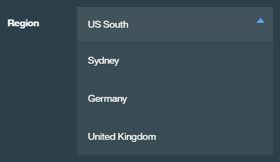
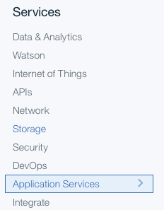
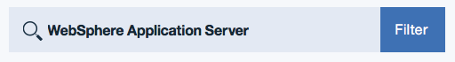
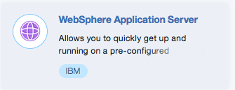
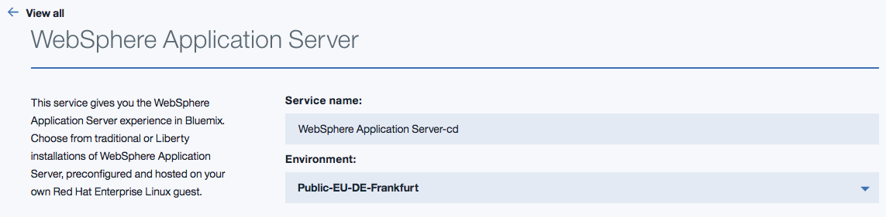
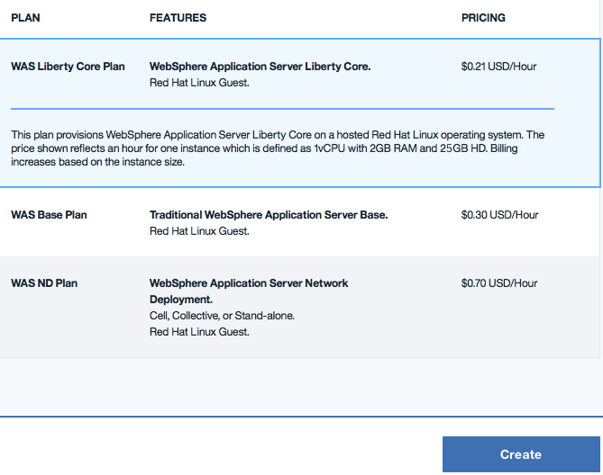

---

copyright:
  years: 2016, 2017
lastupdated: "2017-11-03"

---

{:shortdesc: .shortdesc}
{:new_window: target="_blank"}
{:codeblock: .codeblock}

#Single Tenant Environment Access
{: #singleTenantEnvironment}

The following steps discuss accessing your Single Tenant Environment, along with methods of creating a service instance.
{: shortdesc}

## Accessing your Single Tenant Environment
{: #accessSTE}

1. Go to [https://console.bluemix.net](https://console.bluemix.net){: new_window} in your browser.
2. Click **Log in** and enter your **IBMid**
3. Select the **Region** where your Single Tenant Environment is deployed. Change to the Region wanted by clicking the current Region and selecting from the dropdown menu:

      
4. Click **Catalog** in the upper right once you are in the correct Region:

      

5. Select the **Application Services** category once in the Catalog:

    

6. Type **WebSphere Application Server** in the search filter:

    

7. Click the tile that is named **WebSphere Application Server**:

    

8. Your Single Tenant Environment name is displayed in the **Environment** pull-down menu immediately below the service name:

    

    **Avoid Trouble:** The public environment might be shown as the default, so you might have to click the pull-down menu to find and select your Single Tenant Environment name. Displaying the correct environment name assumes that you are logged in to the correct region, and a member of an organization that is allowed to access your Single Tenant Environment.

    **NOTE:** If you select one of the public environments, you might incur an hourly charge. Therefore, if you do not see your Single Tenant Environment name, then open a Support Ticket as defined on the [Getting Customer Support](https://console.bluemix.net/docs/support/index.html#contacting-support){: new_window} page.

9. Select the appropriate plan and click **Create:**

    

**NOTE:** Hourly pricing does not apply for Single Tenant environments. A Single Tenant environment includes a fixed number of **blocks** that are called a quota. A small environment contains 64 blocks. A medium contains 128 blocks, and a large contains 256 blocks.

A **block** is defined as follows:
  * 1 vCPU
  * 12.5 GB disk[1]
  * 2 GB RAM

[1] *Technically, a small system contains only 12 GB of disk. A medium system contains 25 GB of disk, and a large contains 50 GB, and so on.*

For each virtual machine you create, specify the Tee-Shirt size you desire: S, M, L, XL, or XXL, which corresponds to 1, 2, 4, 8, and 16 blocks. When you select a Tee-Shirt size, the corresponding number of blocks is decremented from your quota.

For example, suppose that you have a small environment, which contains 64 blocks. Within this environment, you configured service instances that contain two XXLs, three XLs, and 1 L for a total of 60 used blocks. If you select a Medium Tee-Shirt size for a new Liberty Core subscription, a message might be displayed that states your quota and the number of blocks still available:

> **Your Single-Tenant memory quota for this service is 64 blocks. Including your current configuration, you have 2 blocks remaining. To increase your memory quota, contact IBM Sales.**

## Private Network Environment
{: #private_network}

After your WebSphere Application Server in {{site.data.keyword.Bluemix_notm}}: Single Tenant Environment is provisioned, you can download your VPN credentials and establish an OpenVPN connection. For more information, see the following links:

* [VPN Access](https://console.bluemix.net/docs/services/ApplicationServeronCloud/networkEnvironment.html#vpnAccess){: new_window}
* [Setting up OpenVPN](https://console.bluemix.net/docs/services/ApplicationServeronCloud/systemAccess.html#setup_openvpn){: new_window}

## Managing your Single Tenant Environment
{: #manageSTE}

To add extra capacity to your existing WebSphere Application Server in {{site.data.keyword.Bluemix_notm}}: Single Tenant Environment or to order capacity in another datacenter, contact your Americas Call Centers, local IBM representative, or your IBM Business Partner. To identify your representative or partner call 800-426-4968. For more information, contact the Americas Call Centers. Phone: 800-IBM-CALL (426-2255) Fax: 800-2IBM-FAX (242-6329).

## Supporting your Single Tenant Environment
{: #supportingSTE}

If you experience issues, you can receive assistance by opening a Support Ticket as defined on the [Getting Customer Support](https://console.bluemix.net/docs/support/index.html#contacting-support){: new_window} page.
